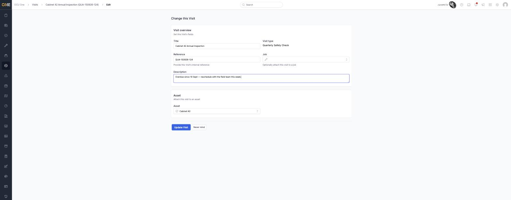
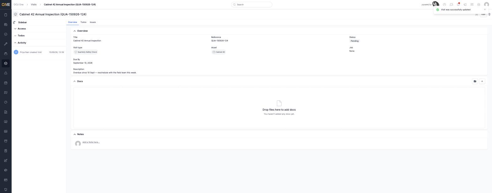
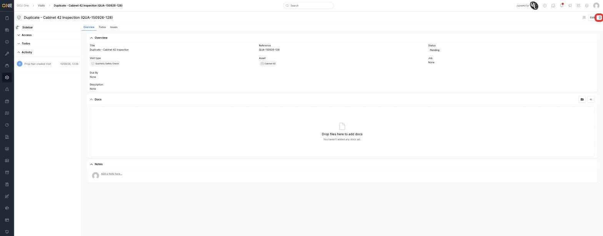
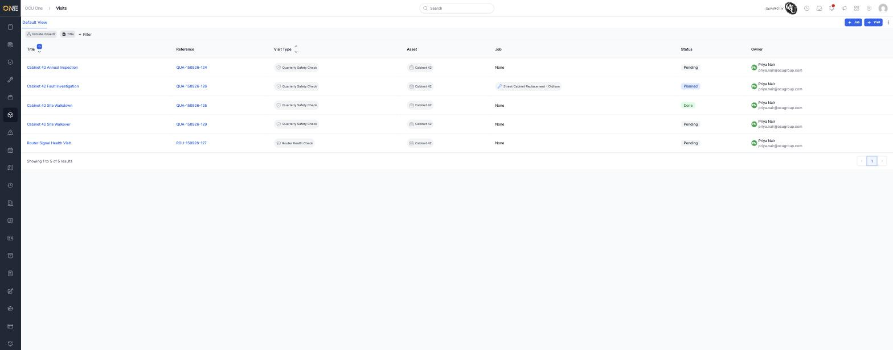

# Editing or deleting a visit

## Editing a visit

Open the visit and click **Edit**. You can change its **Title**,
**Reference**, **Job**, **Description**, and **Asset** — everything except
its **Visit Type**, which is fixed once the visit is created.

Click **Update Visit** to save. The change is reflected immediately and
logged on the visit's activity feed.

## Deleting a visit

From the visit's overview page, click the trash icon in the top-right
corner.

You'll be asked to confirm ("Are you sure you want to delete this?")
before the visit is removed. Deleting archives the visit rather than
erasing it outright, so it drops out of the default Visits list (unless
**Include closed?** is switched on) but isn't gone for good.

## Things to know

- Editing and deleting are both blocked while a visit is part of a **booked
  job** — the visit needs to be unbooked first.
