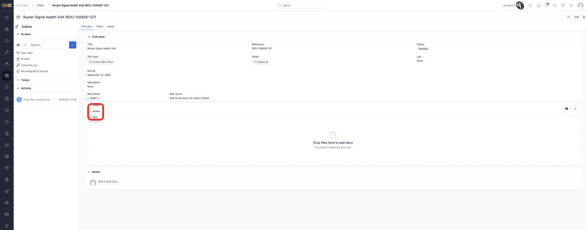
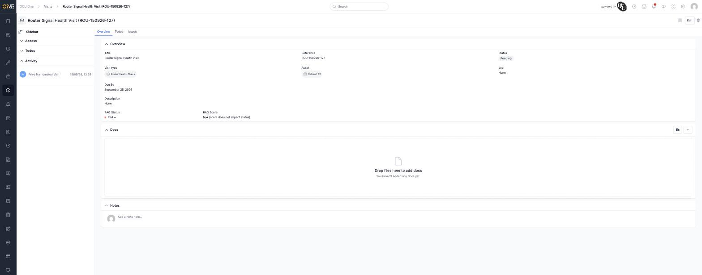

# Updating a visit's RAG status

Where a visit's type has RAG (Red/Amber/Green) tracking turned on, its
Overview tab shows a **RAG Status** and **RAG Score** alongside its other
fields.

## Where to find it

Scroll to the bottom of the visit's main details to find **RAG Status**,
shown as a coloured dot and label with a dropdown arrow.

*RAG Score reads "N/A (score does not impact status)" here, since this
visit type doesn't use automatic scoring.*

## Changing it

Click the RAG Status label to open the dropdown of Green / Amber / Red,
then pick whichever reflects the visit right now.

The change takes effect immediately — no separate save button. RAG status
is a manual judgement call unless the visit type has automatic scoring
configured, in which case the score drives the colour instead.

## Things to know

- The RAG Status field only appears at all if the visit's **Visit Type**
  has RAG tracking enabled — set up in Settings, not something you can turn
  on from the visit itself.
