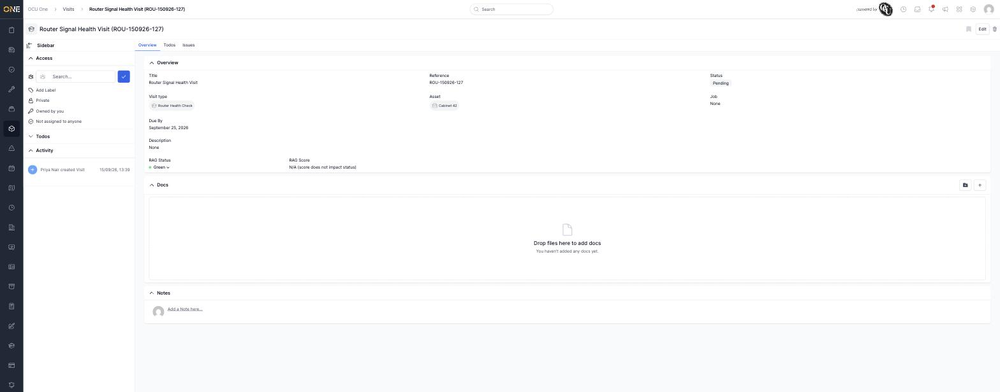

# Viewing a visit's overview page

A visit's Overview tab brings together everything about that trip out to
an asset — its key fields, who can see it, and its full history.

## The Overview tab

Open a visit to land here by default. The main panel shows:

- **Title**, **Reference**, and **Status** (Pending, Planned, Failed, or
  Done — see [Changing a visit's status](Changing%20a%20visit's%20status.md)).
- **Visit Type** and **Asset**.
- **Job** — the job this visit is booked under, if any (see
  [Attaching or detaching a visit from a job](Attaching%20or%20detaching%20a%20visit%20from%20a%20job.md)).
- **Due By** and **Description**.
- **RAG Status** and **RAG Score**, if the visit's type tracks RAG (see
  [Updating a visit's RAG status](Updating%20a%20visit's%20RAG%20status.md)).

Below that, **Docs** and **Notes** sections let you attach files and leave
comments directly on the visit.

## The sidebar

Expand **Access** to see and change who owns the visit, whether it's
private or shared, and any labels attached to it. **Todos** gives a quick
running count of outstanding to-dos without opening the Todos tab (see
[Viewing a visit's to-dos](Viewing%20a%20visit's%20to-dos.md)). **Activity**
lists every change made to the visit, in order, with who made it and when.

## Other tabs

**Todos** and **Issues** sit alongside Overview at the top of the page —
see [Viewing a visit's to-dos](Viewing%20a%20visit's%20to-dos.md) and
[Viewing and raising issues on a visit](Viewing%20and%20raising%20issues%20on%20a%20visit.md).
