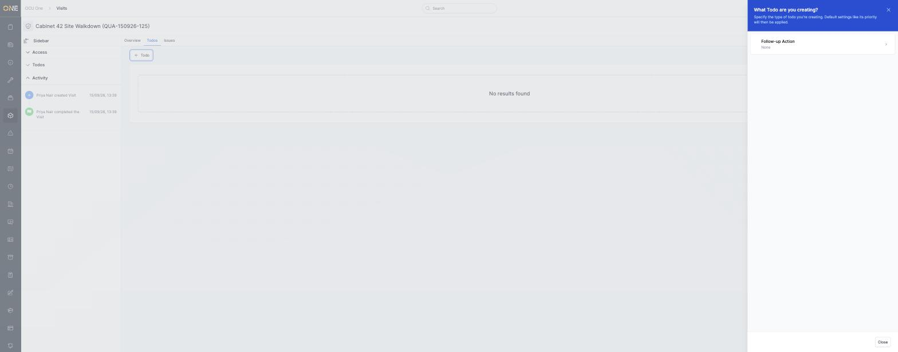
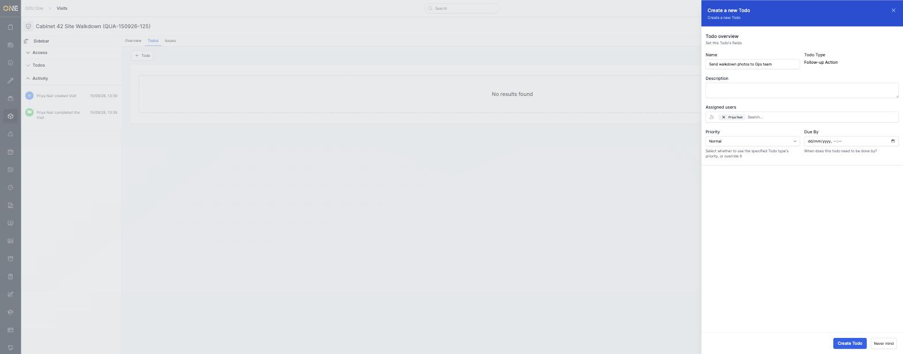
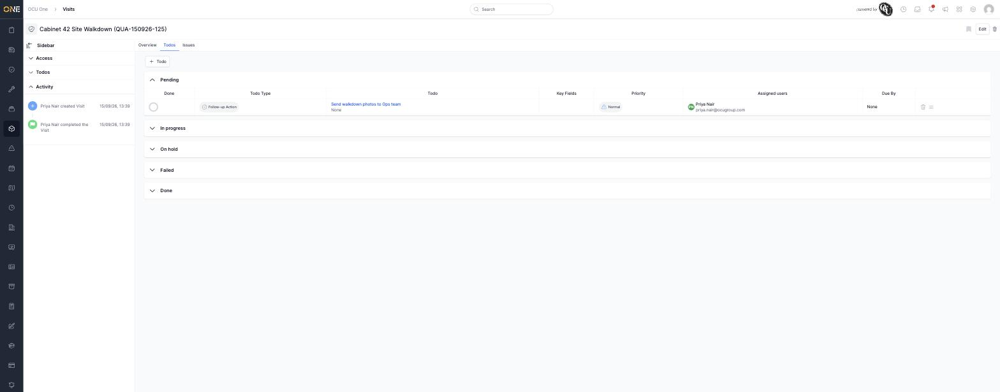
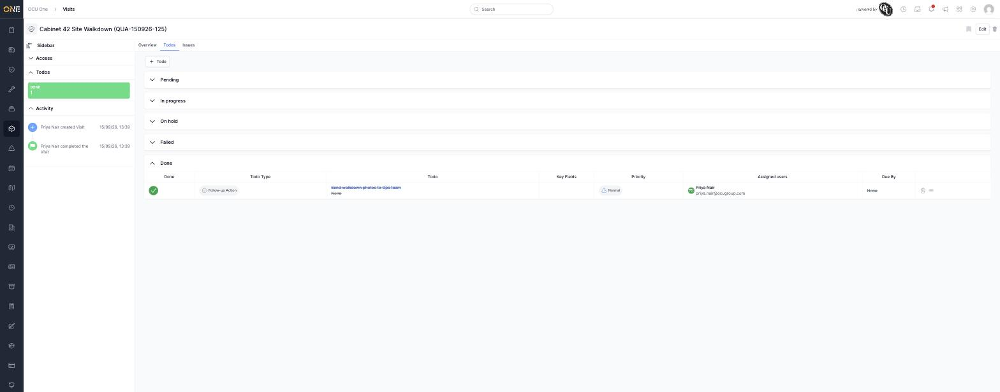

# Viewing a visit's to-dos

Todos are small, trackable tasks tied to a visit — a follow-up call, a
piece of paperwork, anything that needs doing but doesn't warrant its own
job. The **Todos** tab groups them by status.

## Adding a todo

Open the visit and click **Todos**, then **+ Todo**. Pick a **Todo Type**
first (set up in advance) — here, "Follow-up Action" is the only type
available.

Fill in a **Name**, optional **Description**, who it's **Assigned** to,
**Priority**, and a **Due By** date if it needs one.

Click **Create Todo**. It appears in the **Pending** section of the list.

## Reading the list and marking todos done

Todos are grouped into five collapsible sections — **Pending**, **In
progress**, **On hold**, **Failed**, and **Done**. Ticking the circle in
the Done column moves a todo straight to the Done section, shown struck
through.

The sidebar's **Todos** panel on the visit's Overview tab shows a quick
running count, so you don't need to open this tab just to see what's
outstanding.
