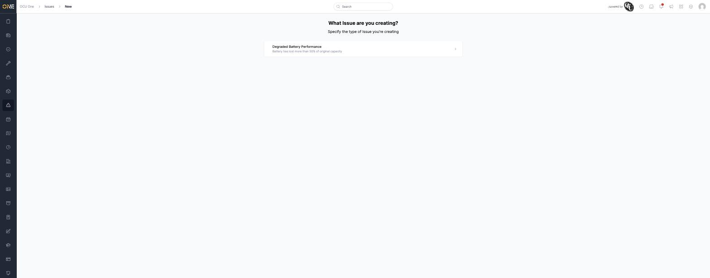
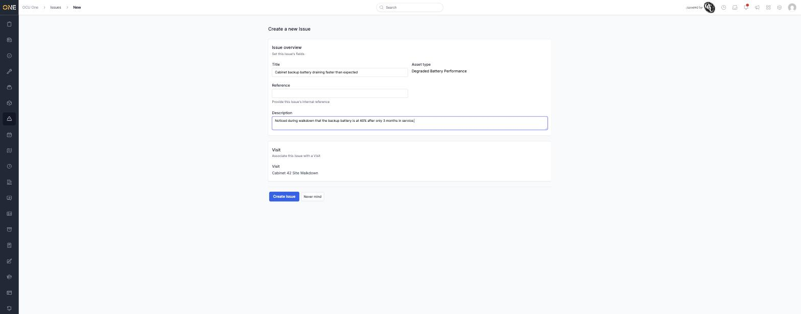
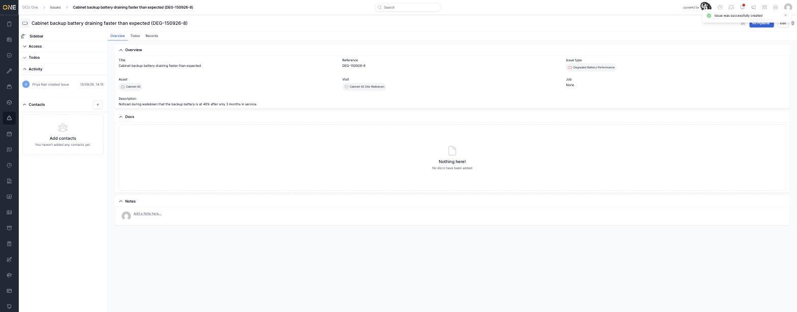
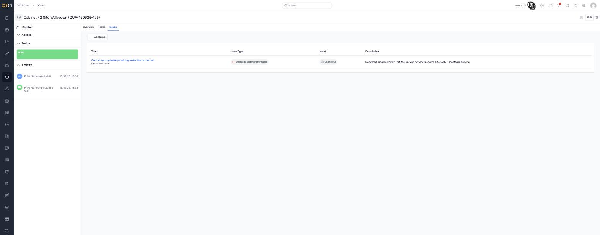

# Viewing and raising issues on a visit

If something's wrong while you're out on a visit — damage, a fault,
anything worth flagging — you can raise an **Issue** directly against it,
without leaving the visit.

## Raising an issue

Open the visit and click **Issues**, then **+ Add Issue**. Pick an **Issue
Type** — here, "Degraded Battery Performance" is the only type available
in this tenant.

Fill in a **Title** and **Description**. The **Visit** field is already
set to the visit you started from, so the issue is linked automatically.

Click **Create Issue**. You land on the new issue's own overview page,
which shows the **Asset** and **Visit** it's linked to.

## Viewing issues on the visit

Back on the visit's **Issues** tab, every issue raised against it is
listed with its Title, Issue Type, Asset, and Description.

**+ Add Issue** only appears if you have permission to edit the visit.
