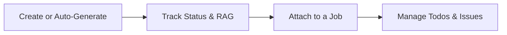

# Visits — Overview

A **Visit** is a planned or completed trip out to an asset — an
inspection, a check, anything that doesn't necessarily need a full job of
its own. This guide explains how the pieces fit together before you dive
into the detailed guides for each part.

## The core pieces

Every visit has a **Visit Type** (set up in advance, similar to job or
asset types), and belongs to exactly one **Asset**. Beyond that it carries
a **Status** (Pending, Planned, Failed, or Done), an optional **Due By**
date, and — where its type supports it — a **RAG Status**.

A visit can be created two ways: manually, or automatically from a
recurring **Visit Plan** attached to an asset (see
[Scheduling a maintenance visit plan for an asset](../Assets/Scheduling%20a%20maintenance%20visit%20plan%20for%20an%20asset.md)).
Once it exists, a visit can optionally be attached to a **Job** — the
booked work that actually carries it out.

## Why this matters

Treating a site visit as its own tracked record, separate from both the
asset it's about and the job that might eventually come from it, is what
makes it possible to:

- **Plan ahead of booking work** — see what's due for inspection before
  deciding whether it needs a job at all.
- **Keep a visit's own history** — todos and issues raised during a visit
  stay attached to that specific trip, not buried inside the asset's
  wider activity feed.
- **Track status independently of the job** — a visit can sit as Pending
  long before anyone books a job for it, and moves to Planned automatically
  the moment it is booked.

## The end-to-end flow

It starts with **finding what's outstanding**: [Browsing visits](Browsing%20visits.md)
lists every visit across your assets, filterable by status, type, or
asset. [Creating a visit](Creating%20a%20visit.md) covers adding one by
hand, from a visit type through to picking the asset it's for.

Once a visit exists, [Viewing a visit's overview page](Viewing%20a%20visit's%20overview%20page.md)
covers everything that page brings together, and
[Editing or deleting a visit](Editing%20or%20deleting%20a%20visit.md)
covers changing its details later or archiving it. Where a visit's type
tracks RAG, [Updating a visit's RAG status](Updating%20a%20visit's%20RAG%20status.md)
covers flagging its health.

[Attaching or detaching a visit from a job](Attaching%20or%20detaching%20a%20visit%20from%20a%20job.md)
covers linking a visit to the booked work that comes from it — done from
the job's own Visits tab — which also drives the visit's status between
Pending and Planned automatically.

Finally, [Viewing a visit's to-dos](Viewing%20a%20visit's%20to-dos.md) and
[Viewing and raising issues on a visit](Viewing%20and%20raising%20issues%20on%20a%20visit.md)
cover everything else that can be tracked against a visit while it's
outstanding.

**Note:** [Changing a visit's status](Changing%20a%20visit's%20status.md)
documents the Status field as it currently behaves — there is presently no
way to change a visit's status directly from the app, beyond the automatic
Pending/Planned switch that comes from attaching or detaching a job.

## The flow at a glance

