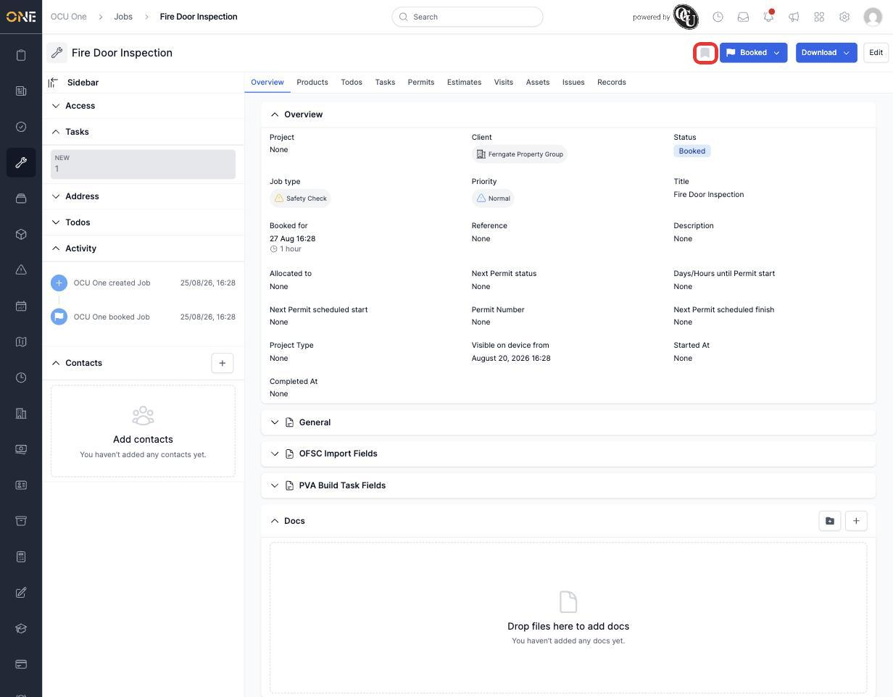
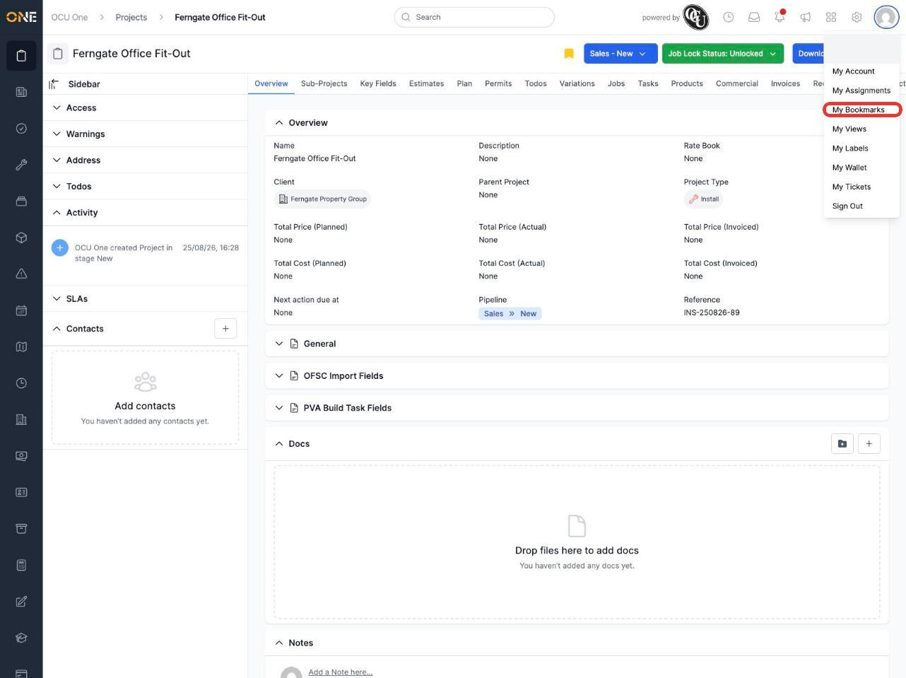
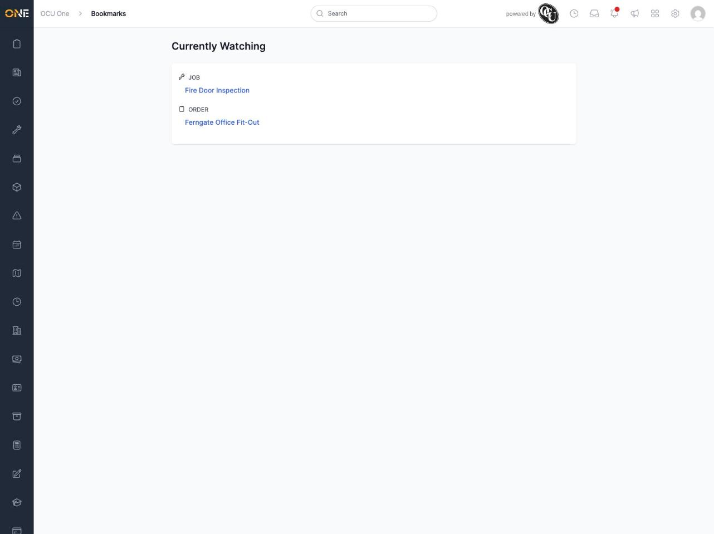
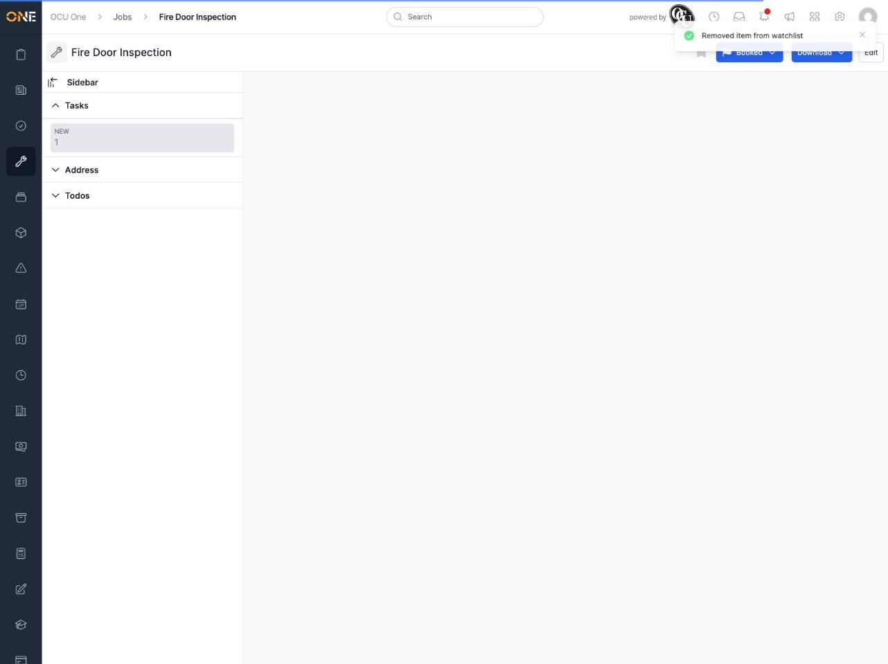

# Managing your bookmarks

If there's a job, project, ticket, or other record you want to keep an easy eye on, you can bookmark it. Bookmarked items are collected in one place so you don't have to go hunting for them again.

## Bookmarking something

On the page for a job, project, ticket, record, client, or most other things in OCU One, look for the bookmark icon next to the status buttons at the top right.

Click it to add that item to your bookmarks. It turns yellow to confirm it's been added, and a confirmation message briefly appears.

## Viewing your bookmarks

Click your profile picture in the top right, then **My Bookmarks**.

This opens the **Currently Watching** page, listing everything you've bookmarked, grouped by what kind of thing it is.

Click any item in the list to go straight to it.

## Removing a bookmark

Go back to the item's own page and click the (now yellow) bookmark icon again. It turns back to grey, a confirmation message appears, and the item disappears from your **My Bookmarks** list.

