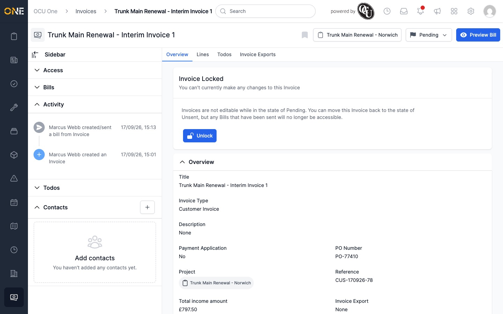

# Activity feed says "created/sent a bill" when an invoice is simply moved to Pending

**Status:** Open
**Found in:** [Updating invoice status and RAG rating](../Invoicing/Updating%20invoice%20status%20and%20RAG%20rating.md)
**Area:** Invoicing

## Description

When an invoice's status is changed to **Pending** using the status dropdown
on its Overview page, the entry added to the invoice's Activity feed reads
"**[user] created/sent a bill from Invoice**" — even when no bill was created
or sent as part of that action. Every other status change (Unsent, Paid,
Void, Archived) logs an accurate "moved Invoice to [status]" message; only
the Pending entry has the wrong wording.

## Preconditions

- Any Customer Invoice in the **Unsent** status.

## Steps to Reproduce

1. Open an Unsent invoice's Overview page.
2. Click the status dropdown (showing "Unsent") and choose **Pending**.
3. Look at the invoice's Activity feed.

## Expected Result

The activity feed shows something like "[user] moved Invoice to Pending" —
matching the wording used for every other status change (e.g. "moved Invoice
to Paid", "moved Invoice to Void").

## Actual Result

The activity feed shows "[user] created/sent a bill from Invoice", which
describes creating a Bill, not changing a status. No bill was actually
created — checking the invoice's Bills list confirms it's still empty.

## Screenshot or Video

Not applicable beyond the screenshot — this is a static text label, not an
interactive flow worth recording as a GIF.
