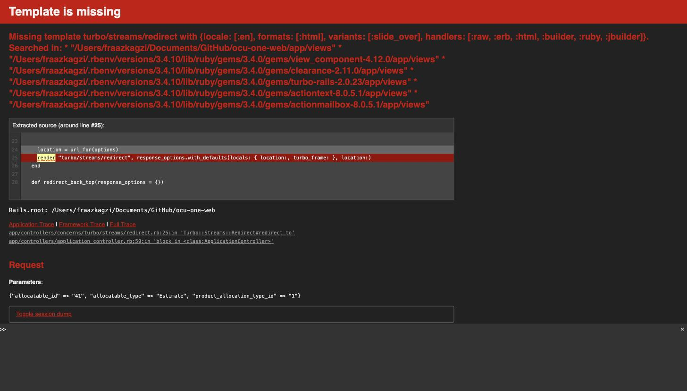
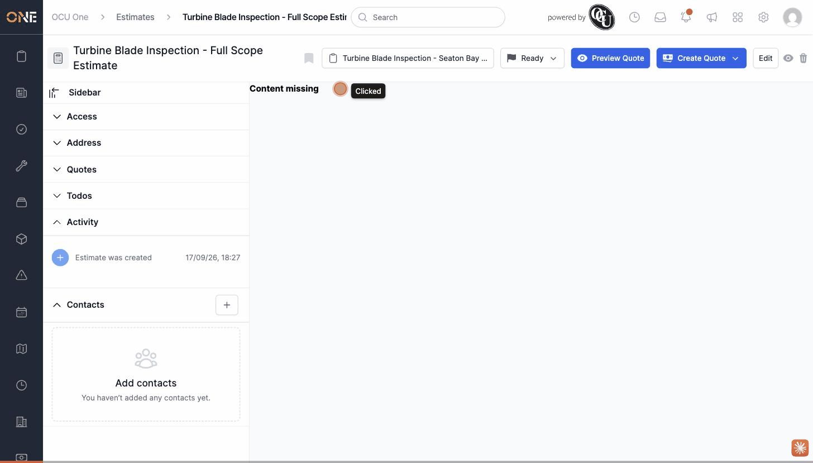

# Adding a product to an estimate crashes with "Template is missing"

**Status:** Open
**Found in:** [Managing products/materials on an estimate](../Estimates%20%26%20Quotes/Managing%20products%20materials%20on%20an%20estimate.md)
**Area:** Estimates & Quotes

## Description

On an estimate's **Products** tab, clicking **+ Product** and choosing an allocation type (e.g. "Default") should open the "Add a Product" picker, the same way it does on a job. Instead it crashes with a server error. The identical flow works correctly when started from a job's Products tab.

## Preconditions

- An estimate exists that is unlocked (status Unsent, Planned, or Ready).
- The estimate's project has an assigned rate book (so there are products to add).

## Steps to Reproduce

1. Open an estimate and go to its **Products** tab.
2. Click **+ Product**.
3. Choose an allocation type from the dropdown (e.g. "Default" or "Planned Works" — reproduces with either).

## Expected Result

The "Add a Product" picker opens (as it does on a job's Products tab), letting you search rate book products and set a quantity.

## Actual Result

The request crashes with a Rails error page:

```
ActionView::MissingTemplate in ProductAllocationsController#new
Missing template turbo/streams/redirect with {..., variants: [:slide_over], ...}
```

from `Turbo::Streams::Redirect#redirect_to`, hit via `application_controller.rb:59`. The request that fails is `GET /product_allocations/new?allocatable_id=<id>&allocatable_type=Estimate&product_allocation_type_id=<id>`. Reproduced with both allocation types available in this tenant. Doing the exact same thing from a job's Products tab (`allocatable_type=Job`) works correctly and opens the picker normally, so this is specific to estimates (and possibly other non-Job allocatable types using the `:slide_over` request variant). After hitting the crash once, the estimate's other tabs can also render blank ("Content missing") until the page is reloaded.

## Screenshot or Video




