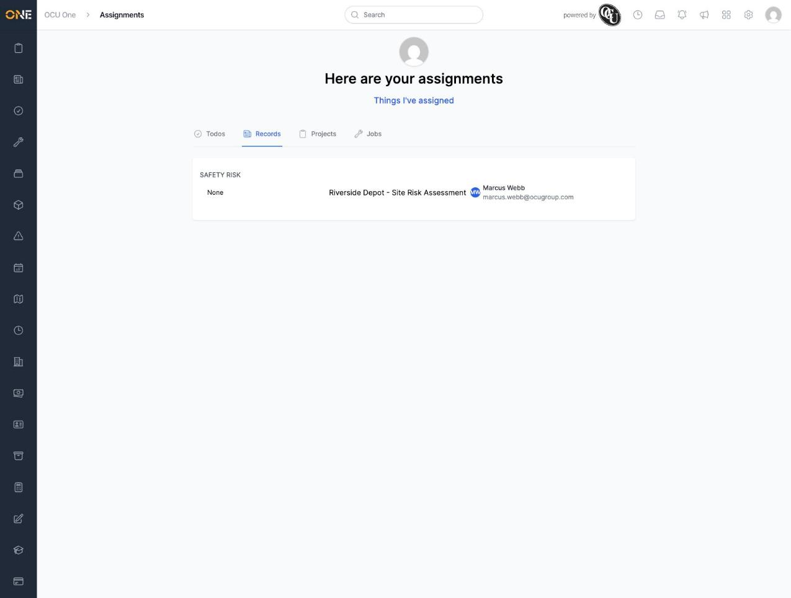
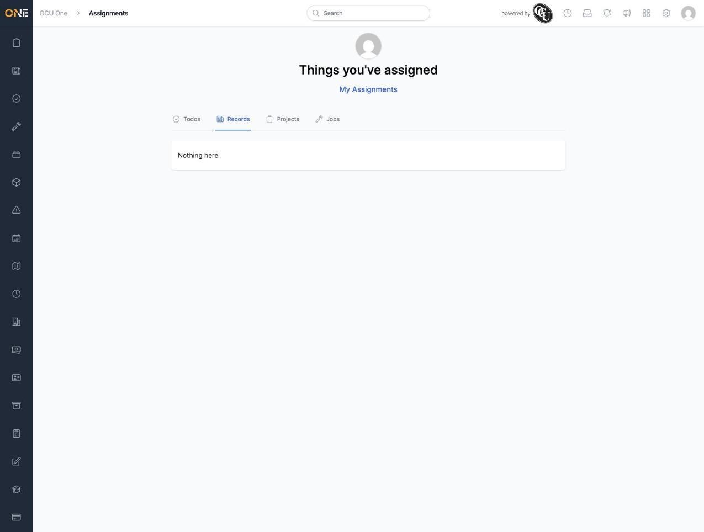

# The "Things I've assigned" view always shows "Nothing here"

## What happens

The Assignments inbox has a toggle at the top — "Things I've assigned" — meant to switch from "things assigned to me" to "things I've assigned to someone else". Clicking it always shows "Nothing here" on every tab (Records, Projects, Todos, Jobs), even when the signed-in user genuinely owns records/projects that are assigned to someone else.

Reproduced live:
1. As Marcus Webb, own a record ("Substation 12 - Cable Fault Report") assigned to a different user (Priya Nair).
2. Own a project ("Substation Refurbishment - Oldham") also assigned to Priya Nair, not to Marcus.
3. Open the Assignments inbox as Marcus — the Records and Projects tabs correctly show items assigned *to* Marcus.
4. Click "Things I've assigned" (or "Things you've assigned", the same page's title once toggled) — every tab (Todos, Records, Projects; Jobs uses the same underlying pattern too) shows "Nothing here", despite Marcus owning both records above with them assigned elsewhere.

## Root cause

`app/models/concerns/jobstra/accessible.rb`, the `owned_not_assigned_to` scope (used by `Record`, `Order`, `Todo`, and `Job` — anything that includes this concern):

```ruby
scope :owned_not_assigned_to, ->(user) { joins(:access).where("? = ANY(accesses.assigned_user_ids) IS NULL", user.id).where("array_length(accesses.assigned_user_ids, 1) IS NOT NULL").where("accesses.owner_id = ?", user.id) }
```

In PostgreSQL, `x = ANY(array)` evaluates to `true` or `false` for a normal array with no `NULL` elements — it never actually evaluates to `NULL` just because `x` isn't found in the array. So the `... IS NULL` check here is never true, and this scope returns zero rows unconditionally, for any user, regardless of what they actually own and have assigned to others. Confirmed directly against the database:

```
SELECT 58 = ANY(ARRAY[16])       -- false  (not present)
SELECT (58 = ANY(ARRAY[16])) IS NULL  -- false (never NULL)
```

`Assignments::Assigned::ByMeService` (`app/services/assignments/assigned/by_me_service.rb`) calls this same broken scope for `:records`, `:orders`, and `:jobs`; `Todo.owned_not_assigned_to` (used for the Todos tab) shares the identical query pattern. This is what the "Things I've assigned" toggle in `AssignmentsController` renders.

## Impact

The "Things I've assigned" side of the Assignments inbox is non-functional — it can never show anything, on any tab, for any user, no matter how much work they've actually delegated. Anyone relying on it to check what they've handed off to their team will always see an empty "Nothing here", which reads as "I haven't assigned anything to anyone" rather than "this view is broken."

## Evidence






Reproduced in this session's local dev environment, 2026-09-09, using two disposable test records/projects built specifically to isolate the issue (deleted after capture — see `Assignments/Viewing assigned records in your Assignments inbox.md` and `Assignments/Viewing assigned projects in your Assignments inbox.md` for the guides written alongside this finding, and `Assignments/_VERIFICATION.md`).
