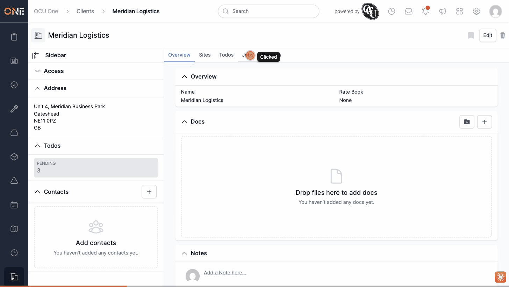

# Clients "Invoices" tab route has no controller action or UI link

**Status:** Open
**Found in:** [Viewing a client's invoices](../Clients/Viewing%20a%20client's%20invoices.md)
**Area:** Clients

## Description

The routes file defines a `tabs/invoices` route for clients (alongside `main`, `todos`, `sites`, `jobs`, and `records`), but `ClientsController` has no `invoices` action or view, and no tab, button, or link anywhere in the app's UI points at this route. There is no way to reach an "Invoices" tab on a client from the client's own page — the tab bar only ever renders Overview, Sites, Todos, Jobs, and Records.

## Preconditions

- Any existing client (e.g. "Meridian Logistics").

## Steps to Reproduce

1. Open a client's overview page (`/clients/:id`) and look at its tab bar — there is no "Invoices" tab to click.
2. Navigate directly to `/clients/:id/tabs/invoices` in the browser's address bar (the only way to reach this route, since nothing in the UI links to it).

## Expected Result

Either the client's tab bar includes a working "Invoices" tab that lists invoices related to the client, or the `tabs/invoices` route is removed if the feature isn't meant to exist yet.

## Actual Result

Visiting `/clients/:id/tabs/invoices` directly raises `AbstractController::ActionNotFound`, rendered as an "Unknown action" error page: "The action 'invoices' could not be found for ClientsController". No client anywhere in the app exposes an Invoices tab to click through to this in the first place.

## Screenshot or Video

## Impact

There is currently no way to view a client's invoices from the client record at all — the feature implied by the route doesn't exist anywhere a user could reach it.
