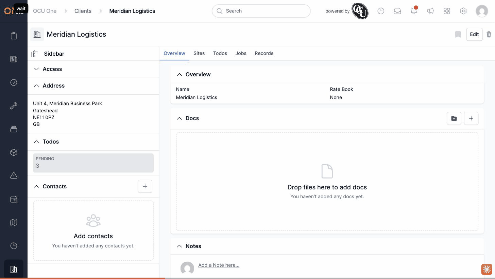

# Clients PDF download route has no controller action or UI link

**Status:** Open
**Found in:** [Downloading a client PDF summary](../Clients/Downloading%20a%20client%20PDF%20summary.md)
**Area:** Clients

## Description

The routes file defines a `pdf/download` route for clients, but `ClientsController` has no `download` action or view, and there's no button or link anywhere on a client's page (or the client edit/show layout) that triggers it. There is no "Download PDF" option available to a user browsing a client record.

## Preconditions

- Any existing client (e.g. "Meridian Logistics").

## Steps to Reproduce

1. Open a client's overview page (`/clients/:id`) and look for any Download or PDF option — none exists on the page, its Edit/Delete buttons, or its sidebar.
2. Navigate directly to `/clients/:id/pdf/download` in the browser's address bar (the only way to reach this route, since nothing in the UI links to it).

## Expected Result

Either the client page offers a working "Download PDF" action that produces a PDF summary of the client, or the `pdf/download` route is removed if the feature isn't meant to exist yet.

## Actual Result

Visiting `/clients/:id/pdf/download` directly raises `AbstractController::ActionNotFound`, rendered as an "Unknown action" error page: "The action 'download' could not be found for ClientsController". No client page anywhere in the app exposes a way to reach this route in the first place.

## Screenshot or Video

## Impact

There is currently no way to download a client PDF summary — the feature implied by the route doesn't exist anywhere a user could reach it.
