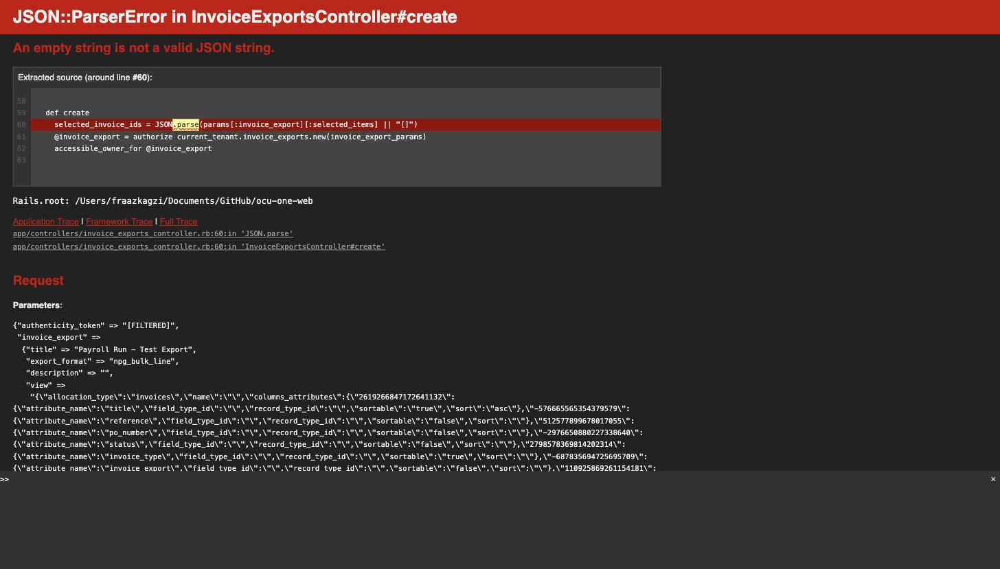
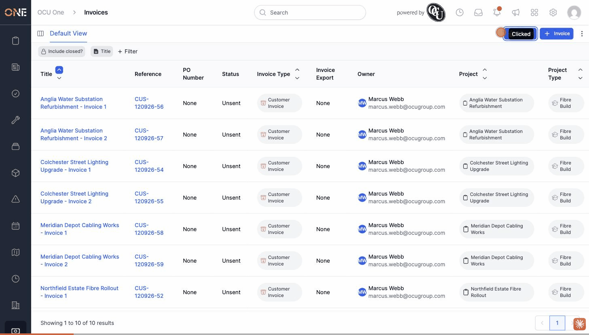

# Creating an invoice export shows no selected invoices and crashes on Create

**Status:** Open
**Found in:** [Creating a batch invoice export](../Invoice%20Exports/Creating%20a%20batch%20invoice%20export.md)
**Area:** Invoice Exports

## Description

Clicking **Export** on the Invoices list opens the "Create a new Invoice Export" page, but the "Selected Invoices" section never shows which invoices were selected, their count, or their total value — and submitting the form to actually create the export crashes with a server error instead of creating anything.

## Preconditions

- At least one invoice exists (any status).
- On the Invoices list (`/invoices`), optionally filtered to a subset of invoices.

## Steps to Reproduce

1. Go to **Invoices**.
2. (Optional) Apply any filter, e.g. Owner contains a specific user, so the list shows a known subset of invoices.
3. Click **Export** in the toolbar.
4. On the "Create a new Invoice Export" page, look at the **Selected Invoices** card.
5. Enter a **Title** and click **Create Invoice Export**.

## Expected Result

- The "Selected Invoices" card should read "Exporting *N* invoices with the total value of: *£amount*" (per the app's own wording template) and list the actual invoices that matched the current filter, with a heads-up message like "You've selected *N* invoices in this export...".
- Clicking **Create Invoice Export** should create the export containing those invoices and redirect to its overview page.

## Actual Result

- The "Selected Invoices" card shows blank text: "Exporting invoices with the total value of:" (no count, no total) and "You've selected invoices in this export..." (no count) — the invoice count and total are missing entirely, and no table of invoices appears below it.
- Clicking **Create Invoice Export** immediately crashes with:
  ```
  JSON::ParserError in InvoiceExportsController#create
  An empty string is not a valid JSON string.
  ```
  at `app/controllers/invoice_exports_controller.rb:60`, in `selected_invoice_ids = JSON.parse(params[:invoice_export][:selected_items] || "[]")` — the hidden `selected_items` field is submitted as an empty string (not `nil`), so the `|| "[]"` fallback never applies and `JSON.parse("")` raises.
- No invoice export is created; the user sees a raw Rails error page.
- Confirmed reproducible from a fresh page load (no stale state) and with no JavaScript console errors — the browser makes no request at all to load the invoice selection table, meaning it never populates client-side either.

## Screenshot or Video





## Impact

This blocks the entire "create a batch invoice export" workflow end to end — there is currently no way to successfully create an Invoice Export through the UI's normal Export-from-Invoices-list flow.
