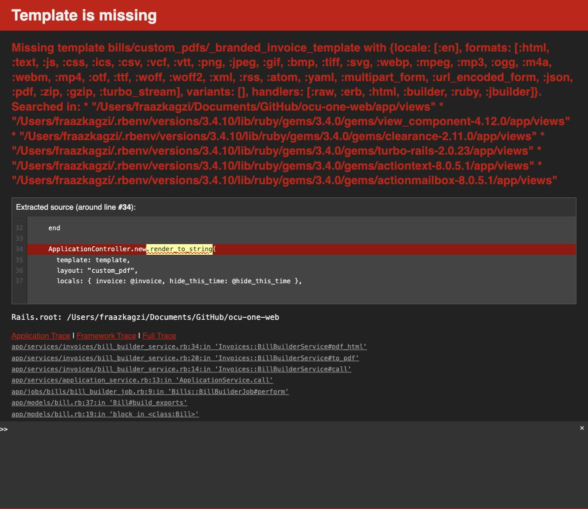
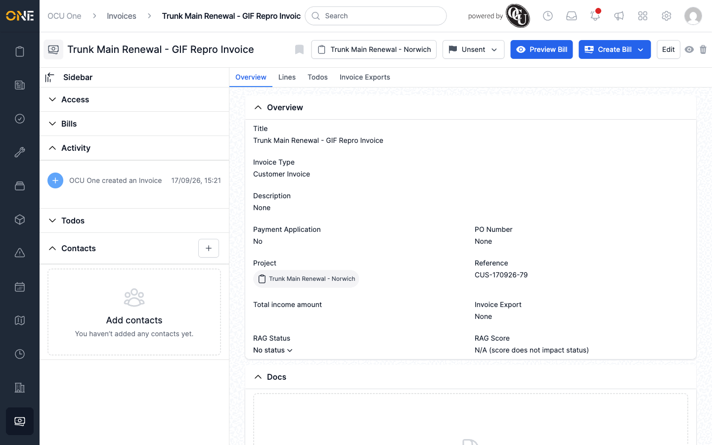

# Creating, sending, or previewing an invoice bill crashes with a missing-template error

**Status:** Open
**Found in:** [Creating and sending an invoice bill (PDF) to a client](../Invoicing/Creating%20and%20sending%20an%20invoice%20bill%20%28PDF%29%20to%20a%20client.md)
**Area:** Invoicing

## Description

The "Customer Invoice" type — the only invoice type set up in this tenant —
is configured to use a custom PDF template called `branded_invoice_template`,
but no such template exists in the app. Every action that renders an
invoice's PDF (**Preview Bill**, **Just create Bill**, and **Create & send
Bill**) tries to render that missing template and crashes with a Rails error
page instead of showing the PDF.

Creating (or creating-and-sending) a Bill still silently creates the Bill
record itself — with the recipient's name, email and message saved, and the
invoice's activity feed showing it was sent — but the actual PDF file is
never attached and, when sending, the email is never delivered, because the
crash happens before either of those steps runs.

## Preconditions

- Any invoice of the "Customer Invoice" type (the only invoice type
  currently configured).

## Steps to Reproduce

1. Open any invoice's Overview page.
2. Click **Preview Bill** (simplest reproduction), or use **Create Bill** >
   **Just create Bill** / **Create & send Bill**.
3. On the "Select images to show on the PDF" screen, click **Proceed**.

## Expected Result

A PDF preview of the invoice opens (for Preview Bill), or a Bill is created
with a working PDF attached and, if sending, an email delivered to the
recipient.

## Actual Result

The app crashes with "Template is missing: Missing template
bills/custom_pdfs/_branded_invoice_template". For **Create Bill**, the Bill
record is still created (visible in the invoice's Bills list and Activity
feed as if it succeeded) but has no PDF attached and no email is actually
sent.

## Screenshot or Video

