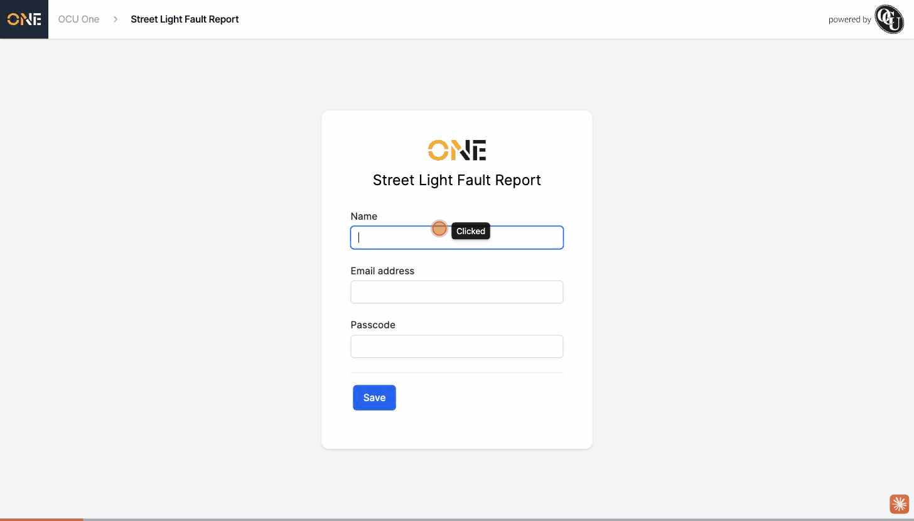

# CSRF token and commit value leak into the public share redirect URL

**Status:** Open
**Found in:** [Accessing a Shared Intake Link and Identifying Yourself](../Public%20Share%20Links/Accessing%20a%20Shared%20Intake%20Link%20and%20Identifying%20Yourself.md)
**Area:** Public Share Links

## Description

After a public visitor identifies themselves on a shared intake link's "Name / Email / Passcode" form, the app redirects them into the new Project (or Record) form. That redirect URL includes a `prefill` query parameter that unintentionally carries the identify form's `authenticity_token` (the Rails CSRF token) and `commit` (the submit button's label) values, exposing the CSRF token in the browser's address bar, browser history, and any server/proxy access logs.

## Preconditions

- A Project Type or Record Type with **Allow Public Creation?** turned on (see [Enabling a Public Intake Link for a Project Type or Record Type](../Public%20Share%20Links/Enabling%20a%20Public%20Intake%20Link%20for%20a%20Project%20Type%20or%20Record%20Type.md)).
- A visitor who is not logged in, visiting that type's share link.

## Steps to Reproduce

1. As a signed-out visitor, go to `/share/<unique-reference>` for a Project Type or Record Type with public creation enabled.
2. Fill in Name, Email address, and (if required) Passcode with valid values.
3. Click **Save**.
4. Once redirected to the "Create a new Project" (or "Create a new Record") form, look at the address bar.

## Expected Result

The redirect URL should only carry the fields the form is actually meant to prefill (name, email, passcode, reference, and any real field-prefill values) — nothing from the identify form's own submission mechanics.

## Actual Result

The address bar shows something like:

`/share/orders/new?email=...&name=...&passcode=4821&prefill%5Bauthenticity_token%5D=xDA_YLbLn1zQPJ6cwxtad8-LLsarGJz1DkU5myJbxYtycHtdIFRwJ2Pwwgduqaq_zr88yo8sMPkNbmKgfeMhHg&prefill%5Bcommit%5D=Save&reference=street-light-fault`

The full CSRF `authenticity_token` value and the literal string `Save` (from `commit`) are appended as `prefill[authenticity_token]` and `prefill[commit]`, visible in the URL.

## Screenshot or Video

![The new Project form's address bar, overlaid with the actual page URL text, showing prefill[authenticity_token] and prefill[commit] appended to the query string](attachments/csrf-token-leaked-into-public-share-redirect-url/01-leaked-url-evidence.jpg)

(The browser extension used to capture these doesn't render the real address bar, so the URL is shown via an injected on-page banner reading the same `window.location.href` the browser bar would show.)

## Root cause

`ShareController::PREFILL_RESERVED_PARAMS` (`app/controllers/share_controller.rb`) lists the params that should be excluded from the field-prefill hash (`controller action reference passcode name email format guest_user record order`), but is missing `authenticity_token` and `commit` — the two params every standard Rails form submission adds automatically. `set_prefill` then does `params.except(*PREFILL_RESERVED_PARAMS)`, which sweeps both of those up into `@prefill`, and they get forwarded into the next redirect's `prefill[...]` query params.
