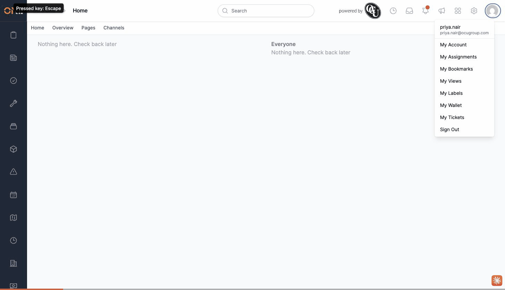

# Deleting a product doesn't cascade to its sub-products despite the confirmation dialog's claim

**Status:** Open
**Found in:** [Deleting a product](../Products%20%26%20Rates/Deleting%20a%20product.md)
**Area:** Products & Rates

## Description

The delete confirmation dialog for a Product says: *"Deleting this will cause all of its sub-resources to be deleted as well. Are you sure?"* — but this isn't true. Deleting a product folder only archives that product itself; its sub-products stay fully active, editable, and reachable at their own URLs, just no longer visible when browsing from the top of the catalog (since their parent is gone).

## Preconditions

- A product folder with at least one sub-product.

## Steps to Reproduce

1. Open a parent product folder (e.g. "Cable Ducting - Riverside").
2. Delete it — the confirmation dialog claims sub-resources will also be deleted.
3. Navigate directly to one of its sub-products (e.g. "Ducting 100mm").

## Expected Result

Per the dialog's own claim, the sub-product should also have been deleted/archived along with its parent.

## Actual Result

The sub-product is still fully active and editable — only the parent product was archived.

## Screenshot or Video

Deleting "Cable Ducting - Riverside" (with the dialog's cascade-delete claim visible), then opening its sub-product "Ducting 100mm" directly — still active, not archived.

## Root cause (brief)

`ProductsController#destroy` (`app/controllers/products_controller.rb:92-98`) only sets `lifecycle = "archived"` on the product itself — no cascade to children. Contrast with `Asset#archive!`, which explicitly loops through `children` and archives each one.

## Impact

Anyone deleting a product folder expecting its contents to go with it (as the dialog promises) will find the sub-products silently still live and editable — orphaned rather than removed.
