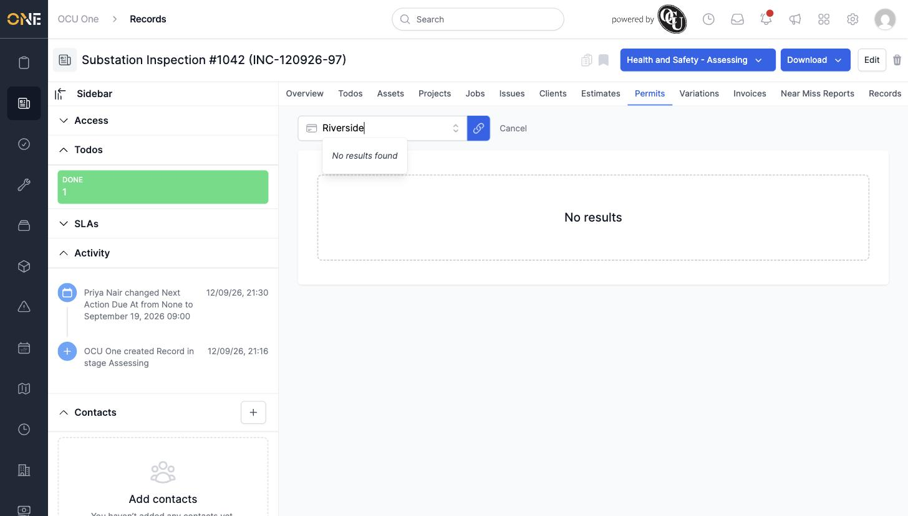
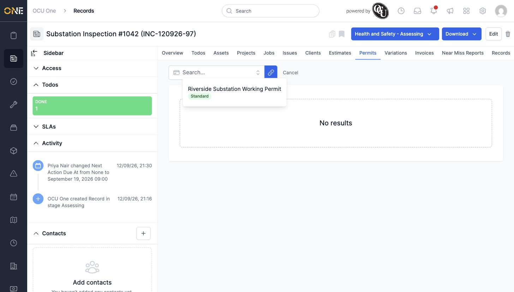

# A draft permit with no reference can't be found by name in the "attach existing permit" picker

**Status:** Open
**Found in:** [Attaching and detaching a permit on a record](../Records/Attaching%20and%20detaching%20a%20permit%20on%20a%20record.md)
**Area:** Records

## Description

When attaching an existing permit to a record (or anywhere else this same
picker is used), typing any part of the permit's actual title into the
search box returns "No results found" — even though the permit exists and
is eligible to attach. Clearing the search box back to empty reveals it
immediately. This happens because the picker's client-side filtering
matches against the permit's reference number, not its title, and a permit
still in Draft status has no reference yet (references are only assigned
once a permit is released/submitted).

## Preconditions

- A permit in Draft status (so its `reference` field is blank) attached to
  a project that the record being worked on is also attached to.

## Steps to Reproduce

1. Open a record whose Permits tab shows no permit yet.
2. Click **Attach → Existing**.
3. Type any word from the permit's title (e.g. "Riverside") into the search
   box.
4. Observe "No results found", even though the permit is real and eligible.
5. Clear the search box back to empty — the permit now appears in the list.

## Expected Result

Typing a word that appears in the permit's own title should find it, the
same way searching by title works for attaching assets, jobs, issues,
clients, estimates, variations, and invoices to a record.

## Actual Result

The search only matches a permit's reference number. A permit with no
reference (any permit still in Draft) is invisible to every search term
except leaving the box empty, making it very easy to conclude a permit
"doesn't exist" or can't be attached when it just hasn't been searched for
correctly.

## Screenshot or Video

A short screen recording of this reproducing live was captured and
downloaded to `~/Downloads/draft-permit-unsearchable.gif`, but a macOS
file-permission restriction on this machine (Terminal doesn't have Files &
Folders access to `~/Downloads`) blocked copying it into this repo's
`attachments/` folder — the two screenshots above are from the same
reproduction. The GIF is available at that Downloads path if needed.
