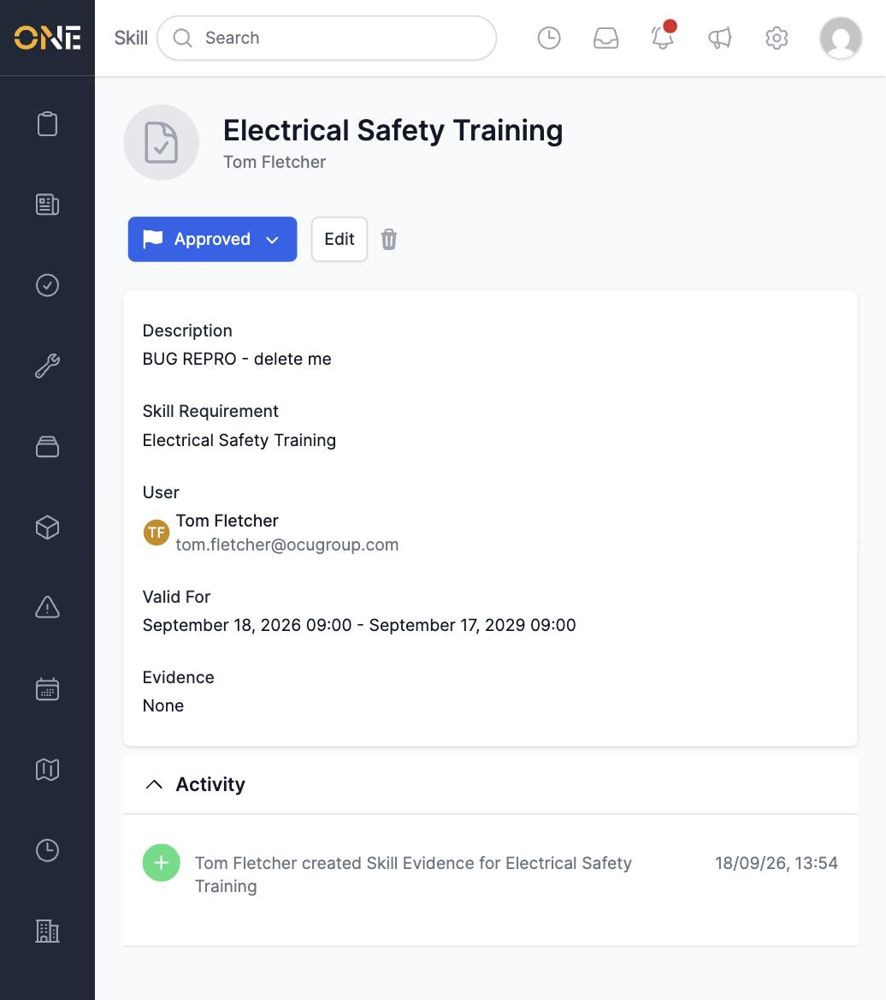
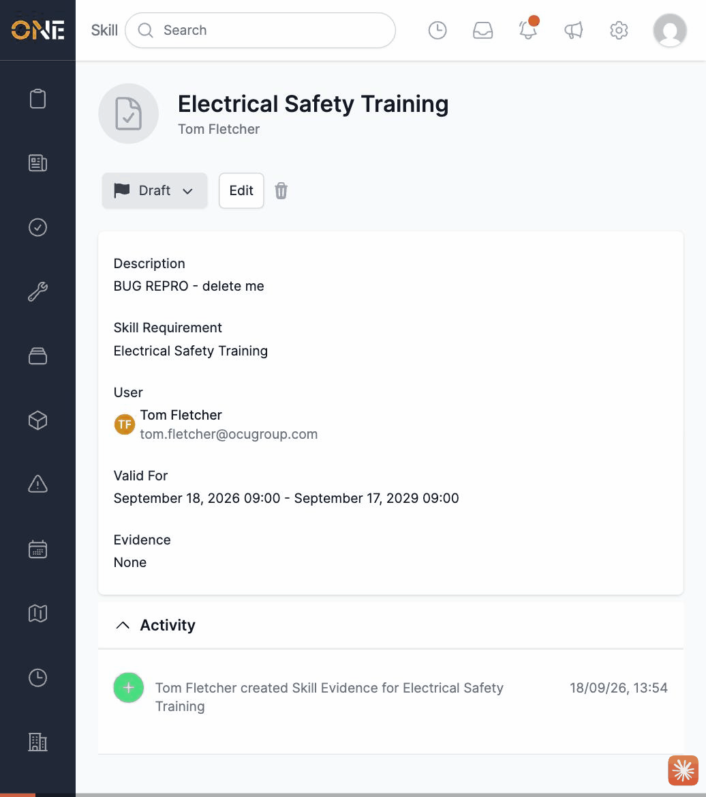

# A field engineer can approve their own skill evidence, skipping manager review

**Status:** Open
**Found in:** [Reviewing, editing, or approving/rejecting skill evidence](../Skills%20&%20Compliance/Reviewing%2C%20editing%2C%20or%20approving%20rejecting%20skill%20evidence.md)
**Area:** Skills & Compliance

## Description

Skill evidence has a status workflow (Draft → Pending → Approved/Denied)
that is meant to require a manager: uploading your own certificate should
only get it as far as **Pending**, with a manager needed to move it to
**Approved** or **Denied**. In the live app, the status control on an
evidence record's page lists all four statuses to everyone, including the
person who owns the evidence being viewed — so a field engineer can open
their own newly-created evidence and set it straight to **Approved**
themselves, with no manager involved at any point.

## Preconditions

- A user with no manager/admin permissions (e.g. a Field Engineer) who has
  created their own skill evidence, currently in **Draft** status.

## Steps to Reproduce

1. Sign in as a non-admin user with no `skills` management permission.
2. Go to **Skills > Add Evidence**, pick any Skill Requirement, and create
   evidence for yourself (status defaults to Draft).
3. Open that evidence's page and click the status badge/dropdown.
4. Select **Approved** directly (skipping Pending).

## Expected Result

A non-manager should only be able to move their own Draft evidence to
**Pending** (submit for review) — the same restriction the codebase
already encodes in `SkillEvidence#next_statuses_operative`, which returns
only `[pending]` for a draft record. Moving to **Denied** or **Approved**
should require a user with the skills manager/update permission.

## Actual Result

The status dropdown offers Draft, Pending, Denied, and Approved to
everyone regardless of role, and clicking **Approved** actually succeeds —
the record's status becomes **Approved** immediately, set by the same
user who owns the evidence, with no manager approval step at all.

## Screenshot or Video

## Root cause

`SkillEvidence` defines `next_statuses_manager` and `next_statuses_operative`
(`app/models/skill_evidence.rb`) specifically to restrict which statuses a
non-manager can set, but neither method is referenced anywhere in the app
— no controller, policy, or view calls them. `SkillEvidencePolicy#status?`
just delegates to `update?`, which returns `true` whenever
`record.user == user && record.status_draft?`, with no check on which
status is actually being requested. The status-picker component renders
the full `SkillEvidence.statuses` enum unconditionally, so the two
role-aware methods on the model are dead code and the restriction they
were built for is never enforced.

## Impact

Undermines the entire skill compliance review workflow this guide topic is
about: any user can grant themselves "Approved" status on any skill
requirement (First Aid, safety training, certifications, etc.) without a
manager ever reviewing the evidence, which is exactly the check a skills
compliance dashboard is supposed to guarantee.
