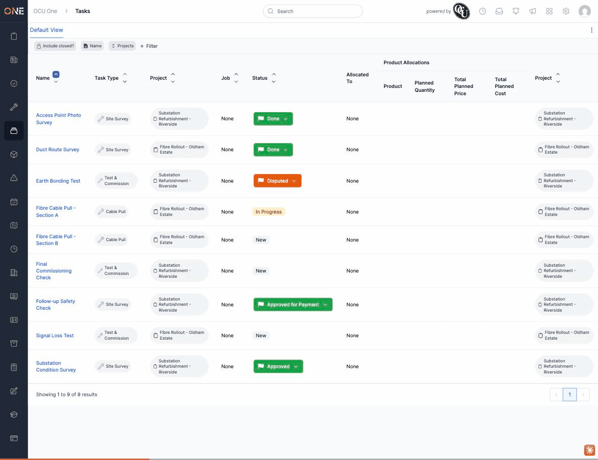
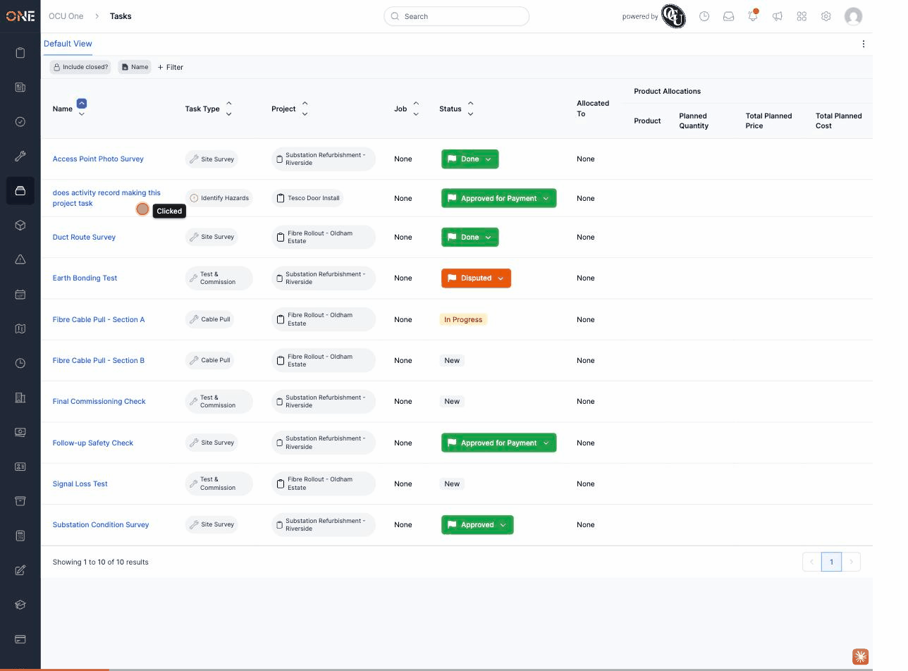

# Filling in a custom field group for the very first time crashes the page

**Status:** Open
**Found in:** [Filling in and editing custom field values on a record](../Custom%20Fields/Filling%20in%20and%20editing%20custom%20field%20values%20on%20a%20record.md)
**Area:** Custom Fields

## Description

When a field group (a set of custom fields, e.g. "Site Info") has just been attached to a record type and no value has ever been saved for it on a given record, opening that field group's edit form crashes with a server error instead of showing the empty form to fill in. Once at least one value has been saved for that field group on that record (by any means), the edit form works normally afterwards — the crash only happens on the very first attempt.

## Preconditions

- A field set/field group newly attached to a type (e.g. a Job Type).
- A record of that type with no existing field values saved for that field group yet.

## Steps to Reproduce

1. Attach a new field set/field group to a type (e.g. a Job Type) that a record of that type doesn't have any existing field values for yet.
2. Open that record and try to get to the new field group's fill-in form (its edit page), e.g. via `/fieldable_field_groups/Job/<id>/<field_group_id>/edit`.

## Expected Result

The empty form for the field group should be shown, ready to fill in.

## Actual Result

The page crashes with `ArgumentError: dom_id must be passed a record_or_class as the first argument, you passed nil` instead of showing the form.

## Screenshot or Video

A second, independent recording of the same crash from earlier in the session:

Reproduced live via `/fieldable_field_groups/Job/<id>/<field_group_id>/edit` on a Job record with a freshly attached field group and zero existing field values, this session (2026-09-04).

## Root cause (brief)

`FieldableFieldGroupsController#get_fieldable_and_group` resolves the field group being edited by searching `@fieldable.associated_field_groups` — but that method only returns field groups that already have at least one saved field *value*, not the full set of field groups the record is eligible for. When no value exists yet, the search finds nothing, `@field_group` ends up `nil`, and the view crashes trying to compute a DOM id from it.

## Impact

A brand-new custom field group can never be filled in for the first time through the normal UI on a record that has no existing values for it — there's no way to reach a working edit form. This blocks the very use case the feature exists for on any newly attached field group until a value gets in some other way.
