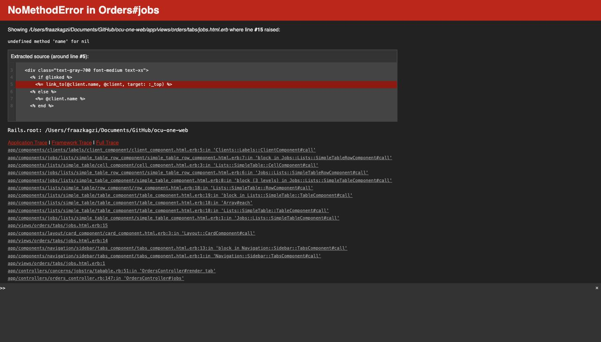

# Creating a job with an unresolved client picker leaves the client blank and crashes the project's Jobs tab

**Status:** Open
**Found in:** [Managing jobs linked to a record](../Records/Managing%20jobs%20linked%20to%20a%20record.md)
**Area:** Records

## Description

When creating a new job and typing a client name into the Client field, the
autocomplete shows two very similar-looking options: the existing client
(e.g. "Tesco") and a separate "Add 'Tesco' as a new client" option. Choosing
the "Add as a new client" option does not actually create a client — the job
is saved anyway with no client attached, even though the form's own
validation message says "Client must exist". Once that job exists, opening
the Jobs tab of the project it's booked to crashes the whole tab for every
viewer with a server error, because the page assumes every job has a client.

## Preconditions

- A job type that allows creating a job directly from a Record's Jobs tab
  (or any other job-creation entry point) — used here: "Safety Check".
- An existing client already in the system with a common name, e.g. "Tesco".

## Steps to Reproduce

1. Start creating a new job (e.g. from a record's Jobs tab: Attach → New →
   pick a job type).
2. Fill in Title, pick a Project, and fill in any required custom fields.
3. In the "Client" field under "Client & User", type the name of a client
   that already exists (e.g. "Tesco").
4. In the dropdown, click **"Add 'Tesco' as a new client"** (instead of the
   plain "Tesco" existing-client option directly above it) — the two are
   easy to confuse.
5. Click "Create Job". The job saves successfully (no validation error is
   shown, despite the client not actually being set).
6. Open the project's **Jobs** tab (the project the new job is booked to).

## Expected Result

Either: choosing "Add '...' as a new client" creates a new client and
attaches it to the job, or the form blocks the save with the same "Client
must exist" validation error it enforces elsewhere. Either way, the Jobs tab
should always render.

## Actual Result

The job is created with `client_id` left blank. The project's Jobs tab then
crashes for every viewer with:

```
NoMethodError in Orders#jobs
undefined method 'name' for nil
app/components/clients/labels/client_component.html.erb:5
```

The tab stays broken until the bad job is found and removed (or fixed) directly
in the database — there's no way to fix it from the UI, since the crash
happens before any job list renders.

## Screenshot or Video



A screen recording of the live reproduction was captured with the browser's
GIF recorder and downloaded to `~/Downloads/job-nil-client-crash.gif`, but a
macOS file-permission restriction on this machine (Terminal doesn't have
Files & Folders access to `~/Downloads`) blocked copying it into this repo's
`attachments/` folder — the static screenshot above is from the same
reproduction. The GIF is available at that Downloads path if needed.
