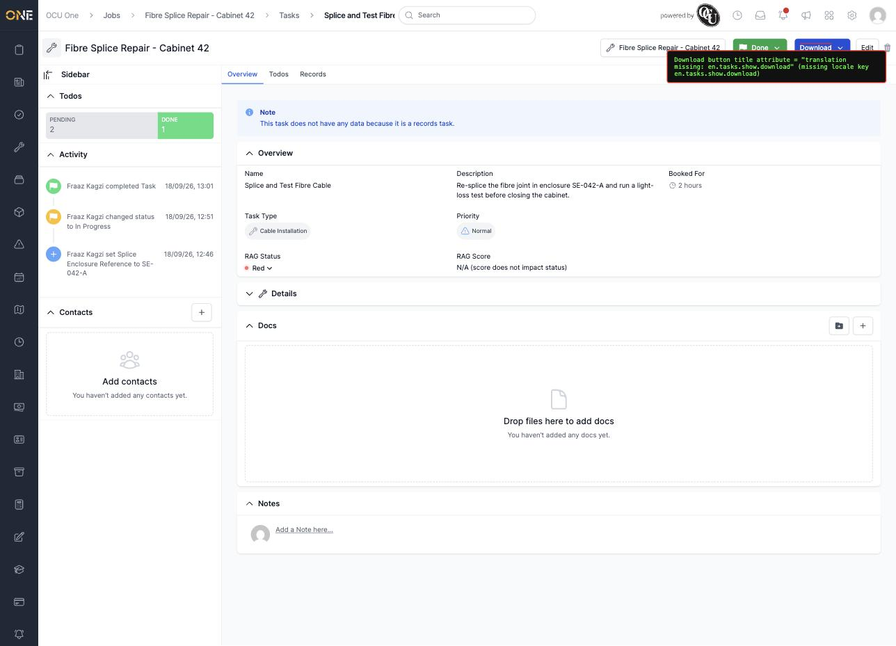
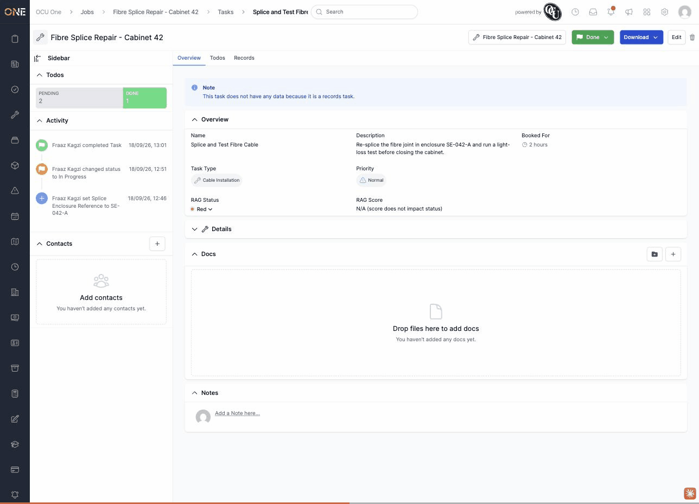

# Job task Download button has a missing-translation tooltip

**Status:** Open
**Found in:** [Downloading or previewing a job task PDF](../Job%20Tasks/Downloading%20or%20previewing%20a%20job%20task%20PDF.md)
**Area:** Job Tasks

## Description

The **Download** button at the top of a job task's page renders its visible label from a missing translation key, rather than a real locale string. It happens to display as "Download" only because Rails' i18n fallback humanizes the last segment of the missing key (`download` → "Download") — the button's underlying `title` attribute (and what a screen reader would announce) is the literal string `translation missing: en.tasks.show.download`.

## Preconditions

- Any job task (works regardless of task type, status, or task type configuration).

## Steps to Reproduce

1. Open any job task's Overview page (e.g. `/jobs/:job_id/tasks/:id`).
2. Inspect the **Download** button at the top right, or hover over it and wait for the tooltip, or check its accessible name/title attribute.

## Expected Result

The button shows a real translation (e.g. matching the job-level equivalent, `en.jobs.show.download: "Download"`), with no `translation_missing` span or broken title/tooltip.

## Actual Result

`config/locales/views/tasks/en.yml`'s `show:` block has no `download:` key at all (it does have `pdf: "PDF"` immediately below where `download:` would go), so the button renders via `Download` — a broken accessible name/tooltip that coincidentally reads correctly as plain visible text.

## Screenshot or Video

## Root cause (brief)

`config/locales/views/tasks/en.yml` is missing a `show.download` key (unlike `config/locales/views/jobs/en.yml`, which has `show.download: "Download"`). The view that renders the task's Download button calls `t(".download")` under the `tasks.show` scope, which has no matching key, so Rails falls back to its `translation_missing` marker.
