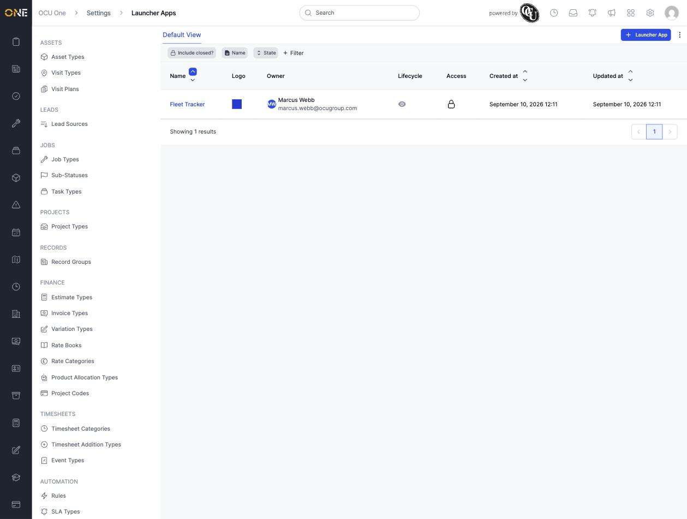
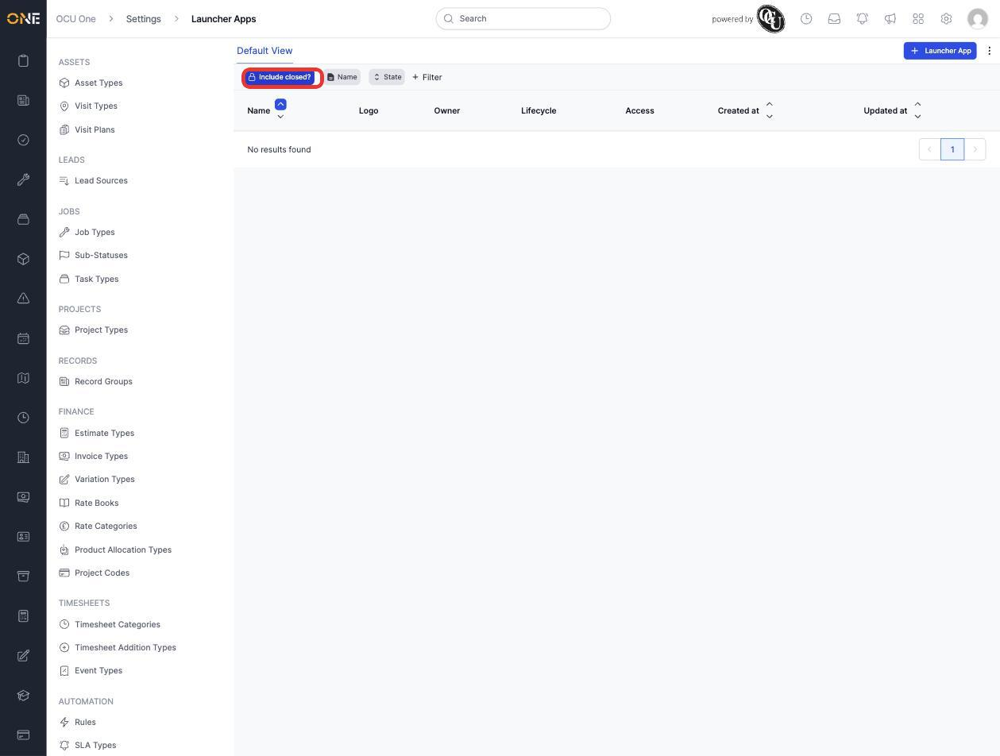
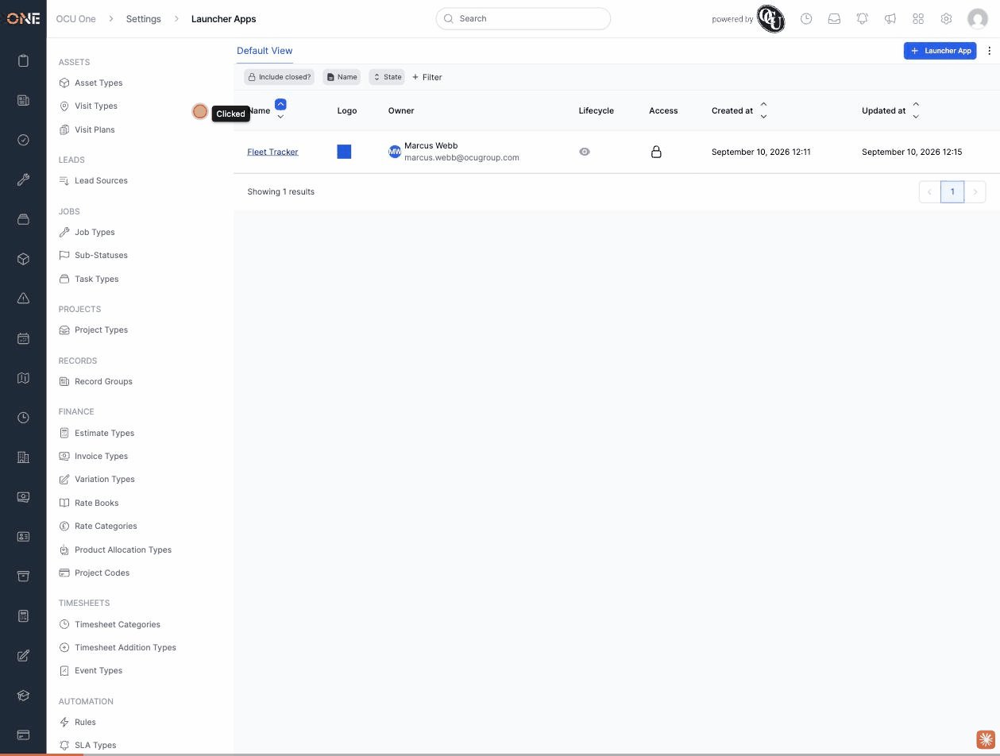
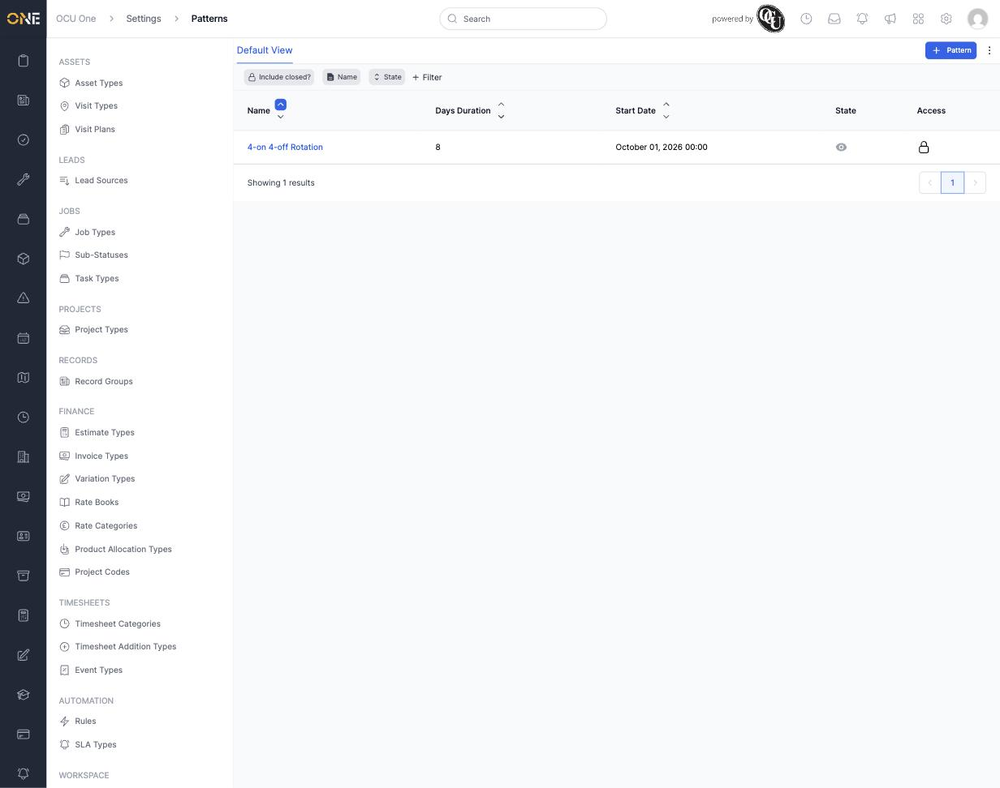
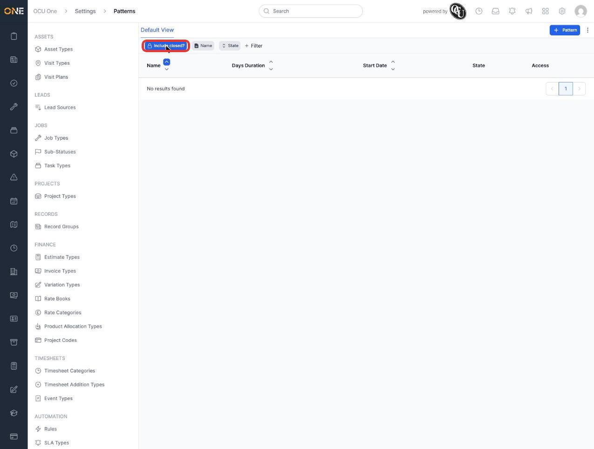
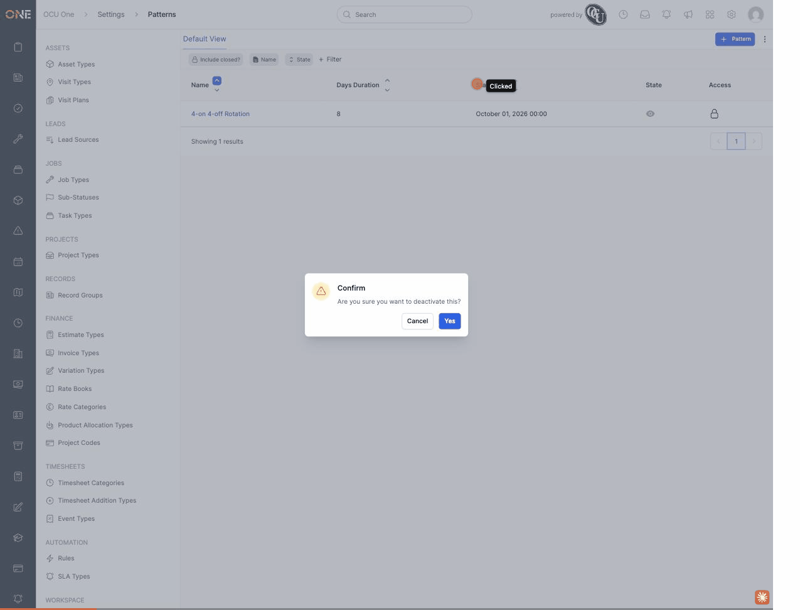
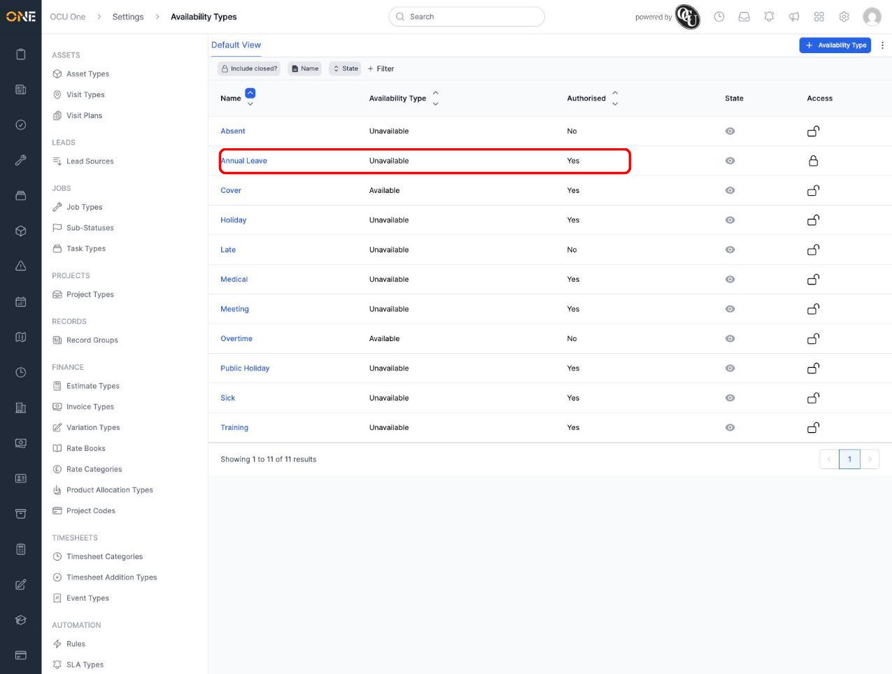
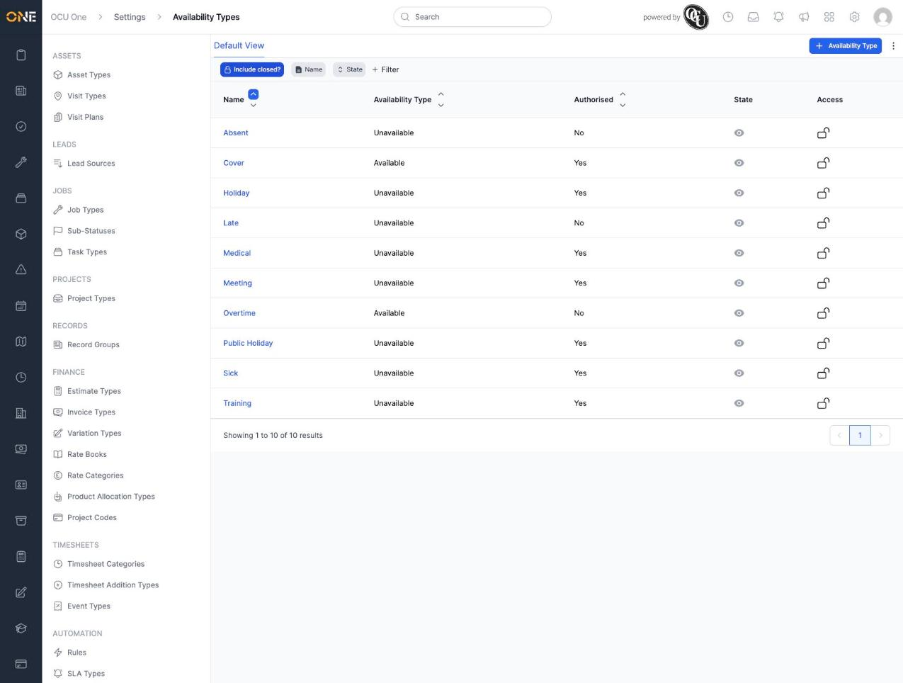
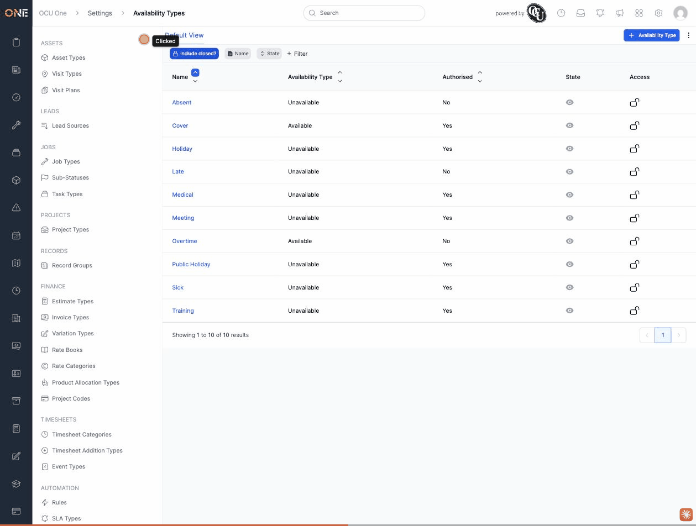

# "Include closed?" never brings back a deactivated record (Launcher Apps, Patterns, Availability Types, and likely other Settings lists)

**Status:** Open
**Found in:** [Configuring app-launcher shortcuts](../Settings/Hub%20Administration/Configuring%20app-launcher%20shortcuts.md), [Creating and managing rotating shift patterns](../Settings/Scheduling%20Reference%20Data/Creating%20and%20managing%20rotating%20shift%20patterns.md), [Managing availability types](../Settings/Scheduling%20Reference%20Data/Managing%20availability%20types.md)
**Area:** Settings: Hub Administration, Settings: Scheduling Reference Data

## What happens

On more than one Settings list screen (confirmed so far on Launcher Apps, Patterns, and Availability Types), deactivating a record removes it from the default list, as expected. But turning on the **Include closed?** toggle — which exists specifically to bring closed/inactive records back into view — does not bring it back. The list stays empty (or missing that row) no matter how long you wait or how many times you toggle it.

Reproduced live, twice in a row on each screen:

**Launcher Apps:**
1. Create a launcher app ("Fleet Tracker") — it appears in the default list, active.
2. Open it and click the eye icon to deactivate it, confirming "Are you sure you want to deactivate this?" — it disappears from the list immediately, which is correct.
3. Click **Include closed?** to turn it on (it highlights blue, confirming the toggle registered).
4. The list still shows "No results found" — the deactivated "Fleet Tracker" never reappears.

**Patterns:**
1. Create a pattern ("4-on 4-off Rotation") — it appears in the default list, active (open eye icon under **State**).
2. Click the eye icon in its **State** column and confirm "Are you sure you want to deactivate this?" — it disappears from the list immediately.
3. Click **Include closed?** to turn it on (it highlights blue).
4. The list still shows "No results found" — the deactivated pattern never reappears.

**Availability Types:**
1. Create an availability type ("Annual Leave") — it appears in the default list, active (open eye icon under **State**).
2. Click the eye icon in its **State** column and confirm "Are you sure you want to deactivate this?" — it disappears from the list immediately (11 results drop to 10).
3. Click **Include closed?** to turn it on (it highlights blue).
4. The list still shows the same 10 results — "Annual Leave" never reappears.

## Root cause

All three screens' underlying list-filter request (`GET /settings/launcher_apps/filter`, `GET /settings/patterns/filter`, `GET /settings/availability_types/filter`) always sends two separate filters together: the visible `Filters::ClosedFilter` that the "Include closed?" button toggles between `is_not_true`/`is_true`, **and** a second, not-visibly-editable `Filters::OptionsFilter` on `lifecycle` hard-set to `string_options[]=active`. Toggling "Include closed?" only ever changes the first filter's operator — the second filter keeps restricting every request, filtered or not, to `lifecycle = active`, so an inactive record can never be returned by either endpoint regardless of the toggle's state. Since this is identical across three unrelated scenes (Launcher Apps, Patterns, and Availability Types), it looks like a shared list/scene component issue rather than something specific to any one model — likely affects other Settings list screens built the same way, not just these three.

## Impact

Once a record on one of these lists is deactivated, there is no way to find it again through that list's UI to review or reactivate it — the "Include closed?" control that exists for exactly this purpose does nothing. Reactivating it requires clicking a still-remembered browser-history link back to its edit panel, or having a developer look it up directly in the data. For screens with only a handful of records this is a nuisance rather than data loss, but it defeats the one control these lists have for recovering a mistakenly closed record.

## Evidence

Reproduced live, twice in a row on each screen, in this session's local dev environment, 2026-09-10, against disposable test records ("Fleet Tracker" launcher app, "4-on 4-off Rotation" pattern, "Annual Leave" availability type) built for their respective guides.
