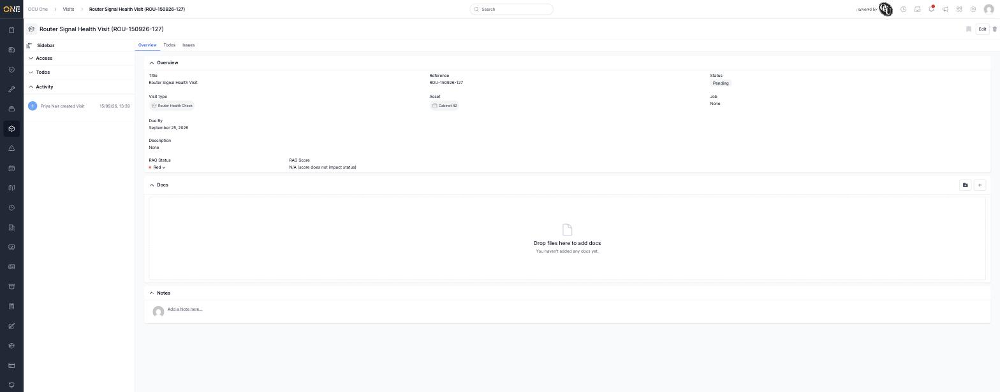
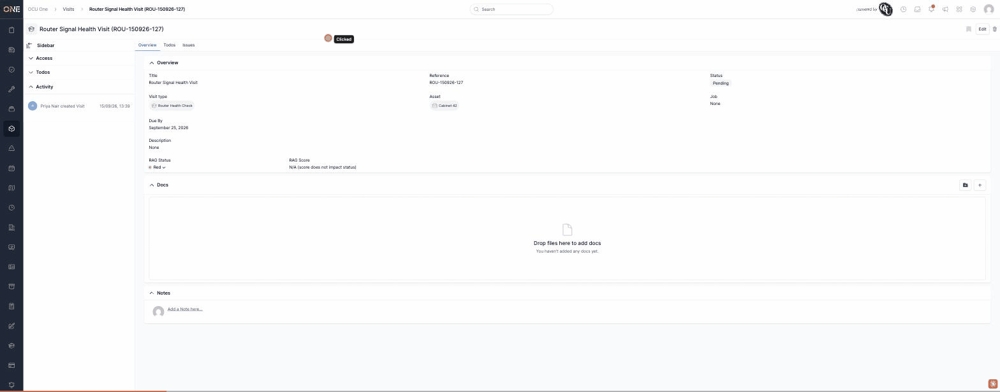

# A visit's status can never be changed from the live app

**Status:** Open
**Found in:** [Changing a visit's status](../Visits/Changing%20a%20visit's%20status.md)
**Area:** Visits

## Description

Every visit has a **Status** (Pending, Planned, Failed, Done) shown as a
badge on its Overview tab, and the backend fully supports changing it —
there's a `PUT /visits/:id/status` endpoint and a complete
`Visits::StatusDropdownComponent` (a status badge that opens into a
dropdown listing every other status, each linking to that endpoint, and
correctly greying out with an explanatory message when the visit is part
of a booked job). None of this is reachable from the app: the Status field
on both the visit's Overview tab and its Edit form is a plain, non-clickable
badge with no dropdown, no button, and no other control anywhere in the UI
that could trigger the change.

## Preconditions

- Any visit, in any status, viewed by a user who could otherwise edit it.

## Steps to Reproduce

1. Open any visit's Overview tab (`/visits/:id`).
2. Click directly on the **Status** badge (e.g. "Pending").
3. Also check the visit's **Edit** page (`/visits/:id/edit`) for a Status
   field.

## Expected Result

Clicking the Status badge opens a dropdown of the visit's other valid next
statuses (e.g. Pending → Planned/Done/Failed), each of which updates the
status when clicked — mirroring the same pattern used for RAG Status on
the same page, and matching the fully-built `Visits::StatusDropdownComponent`
that already exists in the codebase for this exact purpose.

## Actual Result

The Status badge is inert — clicking it does nothing, no dropdown appears.
The Edit form has no Status field either. There is no way for a user to
change a visit's status anywhere in the live app, even though the visit
model, controller action, and dropdown component that would do this all
exist and work correctly when tested directly.

## Screenshot or Video

## Root cause

`Visits::StatusDropdownComponent` (`app/components/visits/status_dropdown_component/status_dropdown_component.html.erb`)
is fully implemented — it renders a dropdown button and links each calling
`status_visit_url(@visit, status:)` — but it is never rendered anywhere.
The Overview tab's fields partial (`app/views/visits/_fields.html.erb`)
renders `Visits::Labels::StatusComponent` instead, which is just a static
`Elements::BadgeComponent` with no interactivity. No other view in the app
references `Visits::StatusDropdownComponent` or `status_visit_path`/`status_visit_url`
except the dead component's own template. The fix is to render the dropdown
component (in place of, or alongside, the static label) wherever a user
should be able to change a visit's status — most naturally on the Overview
tab, next to the RAG Status dropdown, which already follows this pattern
successfully for the same visit.

## Impact

Blocks the entire "move a visit through its lifecycle" workflow via the UI.
The only way to change a visit's status today is directly in the database
(or via the mobile API, if that path is wired up separately) — no
office-based user can mark a visit as Done, Failed, or reset it to Pending
through the web app.
