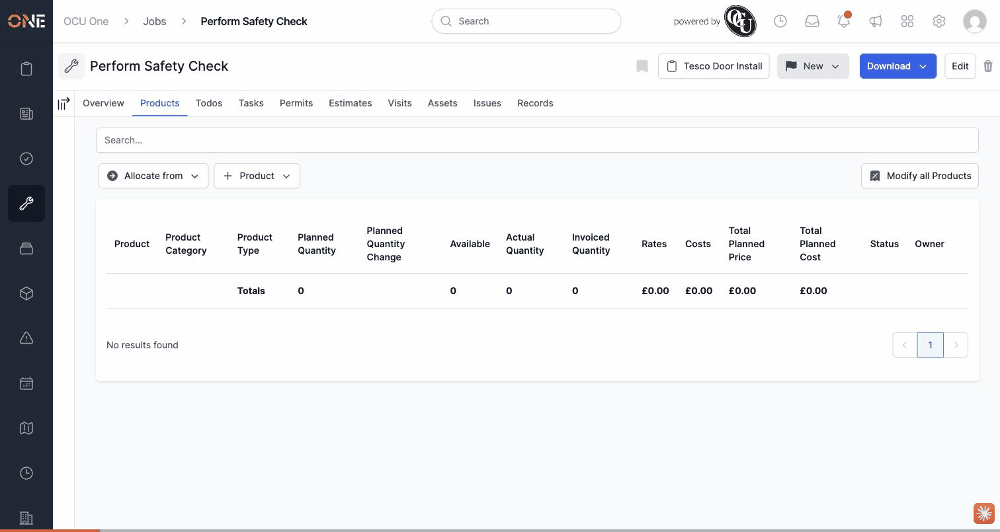

# Product Recordings table on an allocation's detail panel has misaligned columns

## What happens

On a product allocation's detail panel, the **Recordings** section lists every recording made against it in a table headed **Quantity / Status / Notes / User / Created on**. The data shown under those headers doesn't match:

- **Notes** column shows a duplicate copy of the **Status** badge, not the recording's note.
- **User** column shows the actual note text.
- **Created on** column shows the user who completed the recording.
- The completion date is pushed out into a sixth column with no header at all.

Only the **Quantity** and **Status** columns (the first two) line up correctly with their headers. Everything from **Notes** onward is shifted one column to the right, and the real date value has nowhere to land.

Separately, even setting the shift aside, the **Created on** header is itself stale — the column beneath it (once you account for the shift) shows when the recording was *completed* (`completed_at`), not when it was *created*.

## Reproduction

1. Open any job, project, task, estimate, or variation with at least one recorded product allocation (e.g. Job "Substation Cable Run - Riverside Depot", allocation "HV Cable per metre").
2. Click the allocation's name to open its detail panel, and scroll down to **Recordings**.
3. Compare the header row to the data row beneath it — the Status badge appears twice (once correctly under **Status**, once again under **Notes**), and every column after it is shifted by one.

Reproduced against product allocation id 7 (pre-existing test data) on Job "Substation Cable Run - Riverside Depot", recording of 28m dated 2026-09-03. See GIF below.

## Impact

Cosmetic/display-only — no data-integrity issue; the recording's actual note, user, and date are all still saved correctly, just rendered under the wrong headers. But it's visible on every allocation that has recordings, and it's genuinely confusing: at a glance the table appears to show two status badges and no note or date column.

## Cause

Traced to commit `ded8a227d` ("Merge branch 'master' into develop", 2026-08-17), which merged two branches that had each independently added a Status badge column (`PRO-4515`) to the recordings table body — the merge kept both copies of the new `row.with_column` block instead of de-duplicating them, but only one matching header was ever added to `thead`.

## Evidence

Full walkthrough context: `Product Allocations/Editing or removing a product allocation.md`. Found in this session's local dev environment, 2026-09-06.
