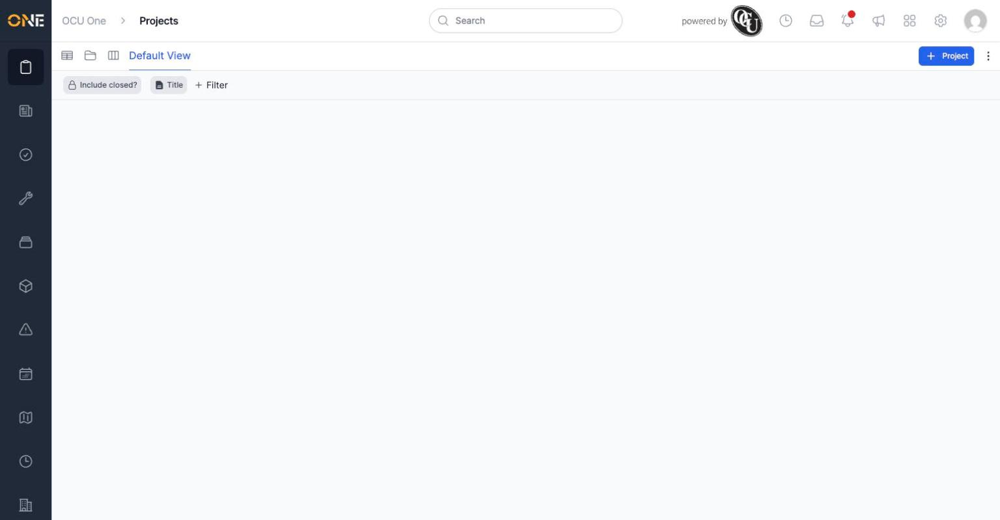

# Projects "Explore" relationship graph never loads for anyone

**Status:** Open
**Found in:** [Exploring projects as a relationship graph](../Projects/Exploring%20projects%20as%20a%20relationship%20graph.md)
**Area:** Projects

## What happens

The Explore view (a graph meant to show projects and their parent/child relationships as connected nodes) never populates. The canvas stays permanently blank, with no on-screen error — it looks like the feature is just slow or the tenant has no data, when actually every request to load it silently fails.

## Root cause

- `app/javascript/controllers/orders/explore_controller.js` (`onSceneCustomFilter`) fetches graph data with a **GET** request: `get(event.detail.url, { query: event.detail.form, responseKind: 'json' })`, using the `get` helper from `@rails/request.js`.
- The only route that can serve this data is `POST /orders/explores/filter` (`config/routes.rb:911-914`, `resources :explores, only: %i[index] do collection { post :filter } end`) — a **POST**-only route. There is no GET route for it.
- Every fetch therefore hits a routing mismatch and fails; the `catch` block in the JS controller only logs `console.error("Could not fetch orders tree", error)` — nothing is shown to the user, so the graph just silently never draws.

## Impact

Affects every account, every tenant, every time this view is opened — the feature is completely non-functional, not a permissions or data issue.

## Evidence

The Explore page after loading — the graph area stays empty indefinitely, with no error shown to the user.
