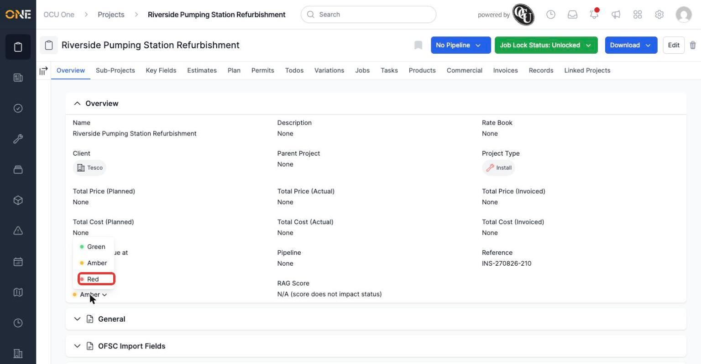
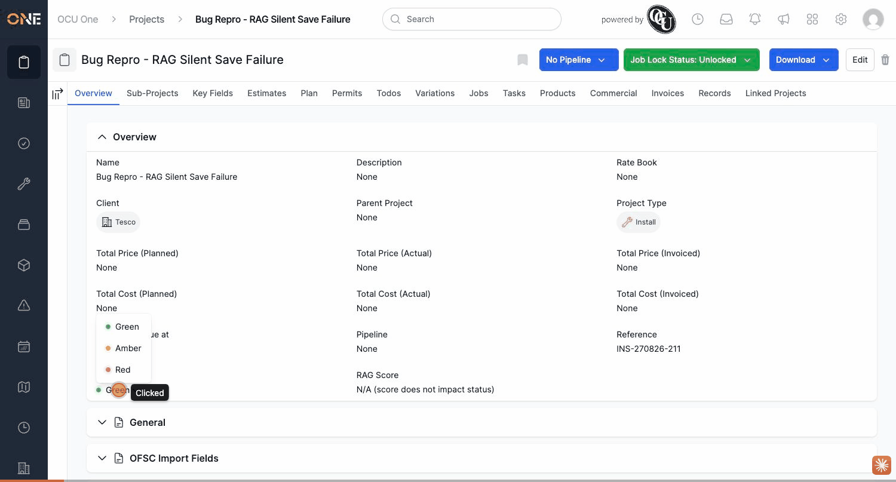

# RAG status and job-unlock changes can silently fail to save

**Status:** Open
**Found in:** [Setting a project's RAG status](../Projects/Setting%20a%20project%27s%20RAG%20status.md), [Locking and unlocking jobs on a project](../Projects/Locking%20and%20unlocking%20jobs%20on%20a%20project.md)
**Area:** Projects

## Description

Changing a project's RAG status, or unlocking a project's jobs, can appear to succeed in the browser (the badge/label updates immediately) while the change is never actually written to the database. There is no error message, no failed-toast, nothing visibly wrong — a user has no way to know the change didn't take. Reloading the page (or navigating away and back) silently reverts the value to whatever it was before.

## Preconditions

- A project record that has *any* unrelated validation issue (e.g. a required custom field left blank) — this is what causes the save to fail silently.

## Steps to Reproduce

**RAG status** (reproduced live, twice in a row):
1. Open a project whose RAG status is "Amber".
2. Click the RAG Status dropdown, select "Red".
3. Query the database directly (or simply reload the page).

**Job unlock** (reproduced once):
1. Open a locked project and click "Unlock".
2. Reload the page.

By contrast, the sibling `job_lock` action (locking a project) worked correctly and consistently in the same session — it persisted every time.

## Expected Result

The RAG status / job-lock change should either persist to the database, or the user should see a clear error if it didn't.

## Actual Result

- RAG status: the label updates to "Red" immediately with no error shown, but `rag_status` in the database is still `"amber"`.
- Job unlock: the header badge flips to green "Unlocked" instantly, but `job_lock_status` in the database stays `"locked_by_user"` until the page is reloaded, at which point the badge reverts to "Locked".

## Screenshot or Video





Reproduced twice: once against project id 210 ("Riverside Pumping Station Refurbishment"), and again against a disposable throwaway project ("Bug Repro - RAG Silent Save Failure", deleted after capture) built specifically to isolate the issue outside real guide data — both showed the identical pattern. In this session's local dev environment, 2026-08-27. Full walkthrough context: `Projects/Setting a project's RAG status.md` and `Projects/Locking and unlocking jobs on a project.md`, with the same finding noted in `Projects/_VERIFICATION.md`.

## Root cause

`app/controllers/orders_controller.rb`:

```ruby
# PUT /orders/1/rag_status/green
def rag_status
  @order.update(rag_status: params[:rag_status])
end
```
(`rag_status` action, ~line 252) — the return value of `update` is never checked. If `@order` fails validation for **any** reason unrelated to `rag_status` itself (a missing required custom field elsewhere on the record, for example), `update` returns `false` and the database write is rolled back — but the in-memory `@order` object still has the new `rag_status` attribute assigned (Rails sets attributes before running validations). The implicit `rag_status.turbo_stream.erb` response then re-renders the RAG status component from that same in-memory `@order`, showing the new value as if it had saved. There is no branch to catch the failure, no flash message, nothing.

`job_unlock` (~lines 337–344) does check the return value:
```ruby
def job_unlock
  if @order.update(job_lock_status: Order.job_lock_statuses[:unlocked])
    redirect_to @order, notice: I18n.t("model_updated", model: Order.model_name.human(count: 1))
  else
    @order.build_nested_attributes(current_user)
    render :show, status: :unprocessable_entity
  end
end
```
— but the `else` branch re-renders `orders/show.html.erb` directly, and that page doesn't appear to surface `@order.errors` anywhere prominent. So the same "attribute assigned but not persisted" object gets rendered, the header badge reads the in-memory (unsaved) `job_lock_status`, and the 422 response looks like a normal, successful page to the user — no visible error, no explanation.

`job_lock`'s success (by contrast) isn't because it handles this differently — it's simply that the specific record used in that test happened to pass full validation at that moment, so there was nothing to silently fail on.

## Impact

Any user changing a project's RAG status or unlocking its jobs on a project record that has *any* unrelated validation issue (a required custom field left blank being the case found here) will believe their change was saved when it wasn't, with zero indication anything went wrong. This could plausibly explain confusing "it didn't save" reports — the record briefly looks correct on screen, then quietly reverts on the next page load, with no error for the user or support to go on.
