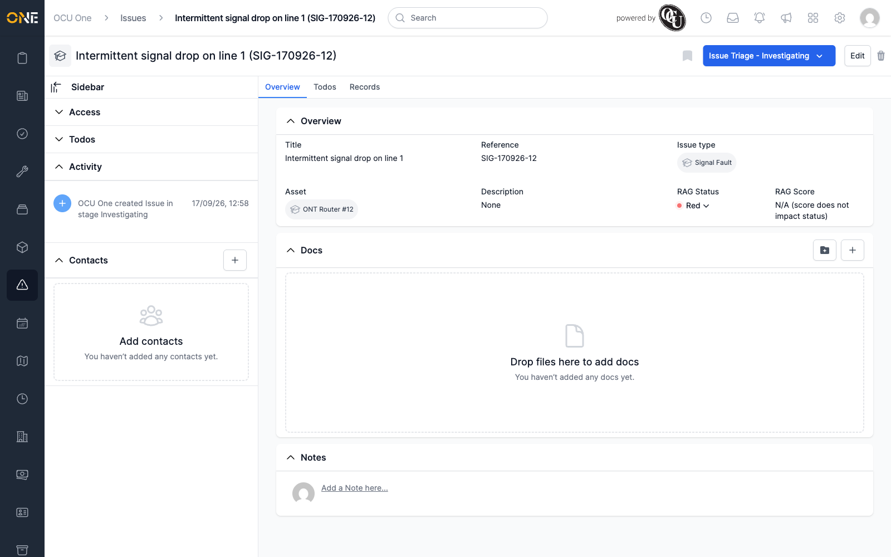
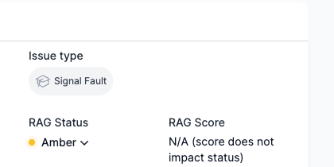

# RAG status badge does not refresh after update

**Status:** Open
**Found in:** [Updating an issue's RAG status](../Issues/Updating%20an%20issue's%20RAG%20status.md)
**Area:** Issues

## Description
On an Issue's Overview page, changing the RAG Status from the colour-coded
dropdown (Green/Amber/Red) saves correctly, but the badge on screen keeps
showing the old colour and label until the page is reloaded.

## Preconditions
- The Issue's Issue Type has a RAG Status enabled (e.g. "Signal Fault").
- Viewing that Issue's Overview page.

## Steps to Reproduce
1. Open an Issue whose type has RAG Status enabled, currently showing
   RAG Status "Amber".
2. Click the "Amber" RAG Status badge to open its dropdown.
3. Click "Red".
4. Look at the RAG Status field without reloading the page.
5. Reload the page.

## Expected Result
After step 3, the RAG Status badge should immediately update to show "Red".

## Actual Result
After step 3, the badge still reads "Amber" — the change appears to have
silently failed. Reloading the page (step 5) reveals the update actually
did save correctly and now shows "Red". The on-screen badge was simply
stale until a manual reload.

## Screenshot or Video

## Impact
A user changing an Issue's RAG Status has no visual confirmation that the
change went through, and may reasonably conclude the click didn't work and
try again or assume the status is still wrong — when the underlying value
was in fact updated correctly server-side.
