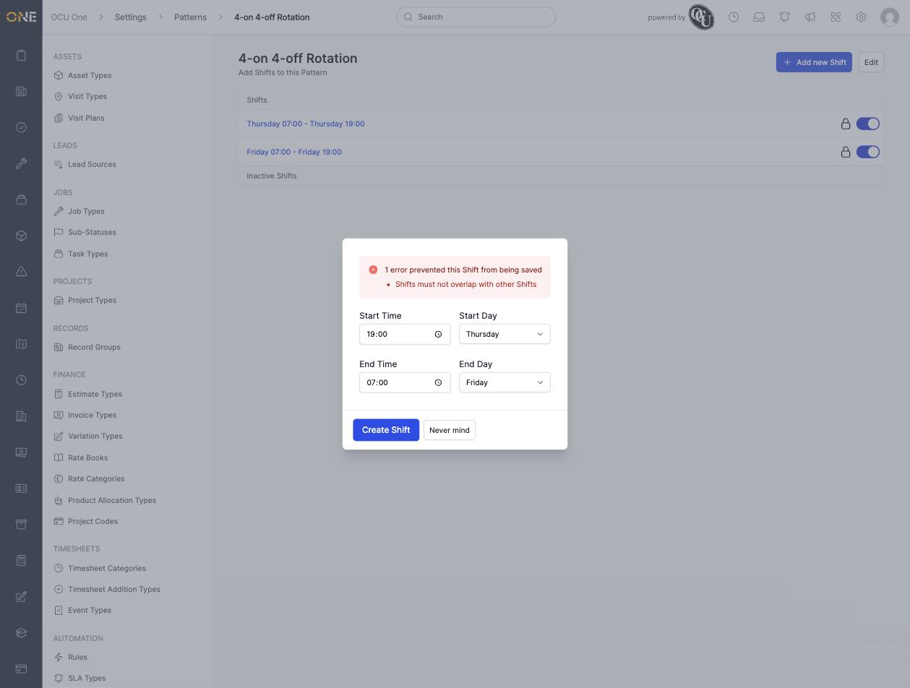

# A shift pattern rejects a new shift that starts the exact moment another one ends

**Status:** Open
**Found in:** [Creating and managing rotating shift patterns](../Settings/Scheduling%20Reference%20Data/Creating%20and%20managing%20rotating%20shift%20patterns.md)
**Area:** Settings: Scheduling Reference Data

## Description

On a Pattern's shift list (Settings > Assets > Patterns > a pattern), adding a new shift that starts at the exact moment an existing shift on the same day ends is rejected with "Shifts must not overlap with other Shifts" — even though the two shifts don't actually share any working minute. This makes it impossible to build a pattern with back-to-back shifts (e.g. a day shift followed immediately by a night shift), which is one of the most common real-world uses of a rotating shift pattern.

## Preconditions

- A pattern with an existing shift (e.g. "Thursday 07:00 - Thursday 19:00").

## Steps to Reproduce

1. On a pattern with an existing shift "Thursday 07:00 - Thursday 19:00", click **Add new Shift**.
2. Set **Start Time** 19:00, **Start Day** Thursday, **End Time** 07:00, **End Day** Friday — a night shift starting exactly when the day shift ends.
3. Click **Create Shift**.

## Expected Result

The shift should save without error — its hours (19:00 Thursday–07:00 Friday) never overlap the existing shift's hours (07:00–19:00 Thursday) at any point except the single instant they touch.

## Actual Result

The form re-renders with: "1 error prevented this Shift from being saved — Shifts must not overlap with other Shifts". Setting the new shift's start time to one minute later (19:01) saves without any error, confirming the boundary instant itself is being treated as an overlap.

Independently confirmed at the code level: Ruby/ActiveSupport's `Range#overlaps?` treats two ranges that only touch at a shared endpoint as overlapping (`(a..b).overlaps?(b..c)` is `true`), and the app's overlap check uses this method directly on the shifts' time periods without excluding that shared boundary instant.

## Screenshot or Video

Reproduced live, twice in a row, in this session's local dev environment, 2026-09-10, against a disposable test pattern ("4-on 4-off Rotation") built for `Settings/Scheduling Reference Data/Creating and managing rotating shift patterns.md`.

## Impact

A pattern can't represent full, continuous coverage across a shift change — the exact scenario a "day shift then night shift" or "shift handover" rota needs. The only workaround is to leave at least a one-minute gap between shifts, which doesn't match how a real shift handover works and would misrepresent the actual schedule if used as documented working hours.
