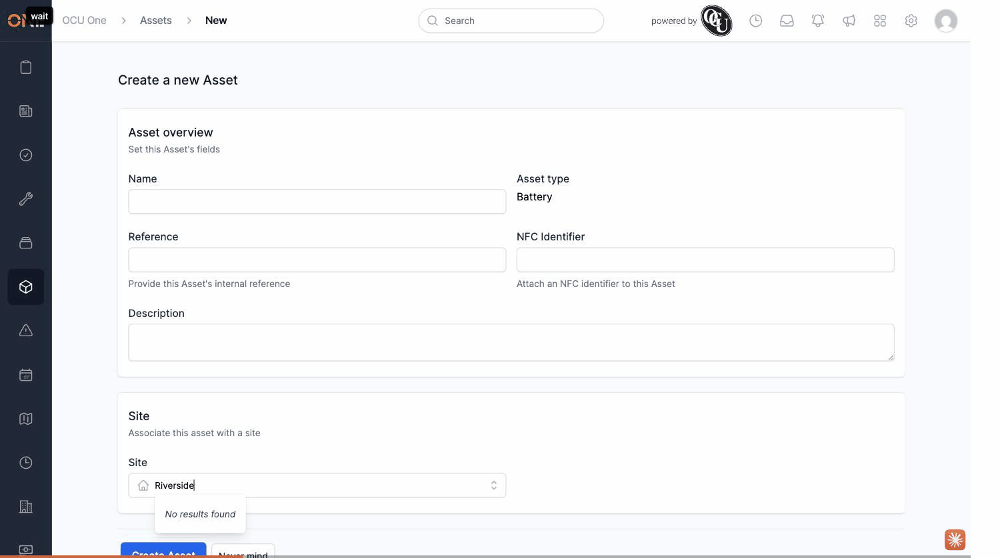

# Site autocomplete ignores role permissions — visibility is scoped by direct Access only

**Status:** Open
**Found in:** [Creating an asset](../Assets/Creating%20an%20asset.md)
**Area:** Assets

## What happens

On the "Creating an asset" form (and anywhere else the Site picker is used), searching for a site returns "No results found" unless the searching user personally owns that site, is explicitly shared/assigned to it, or the site happens to be marked public. This holds true **even for a user whose role has been explicitly granted "Sites: Read" permission** — that role permission has no effect on what the Site autocomplete returns.

In practice this means most users can only attach a site they personally created — any site created by someone else is invisible to them in this picker, regardless of their role's permissions.

## Root cause (brief)

`SitePolicy::Scope#resolve` (`app/policies/site_policy.rb`) delegates to the base `ApplicationPolicy::Scope#resolve`, which filters purely by direct Access (owner/shared/assigned/public) and never checks role-based permissions (`has_permission?`) at all — unlike most other pickers in the app. Site's default visibility on creation is `private` (`app/models/concerns/jobstra/accessible.rb`), so a normally-created site is invisible to anyone but its owner.

## Impact

Any user without direct Access to a given site — including one with full "Sites: Read" permission via their role — can't find or attach it. Likely affects most day-to-day asset creation where the person doing it isn't the site's original creator.

## Evidence

Reproduced with a fresh Admin-role test account searching for a normally-created (private-visibility) site it doesn't own — "No results found" despite the role's Sites: Read permission being enabled.
