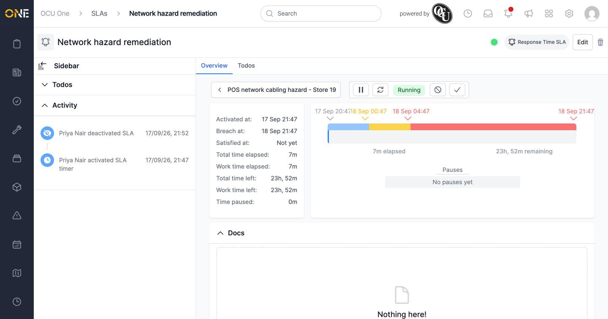
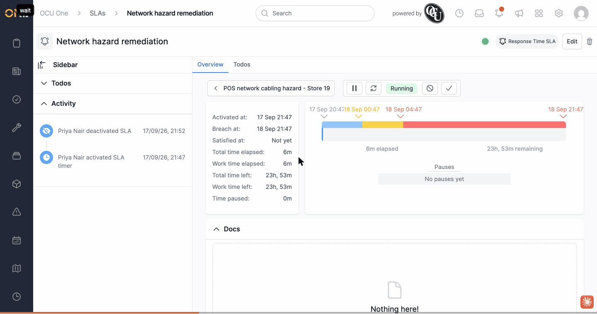

# SLA activate/deactivate has no UI entry point

**Status:** Open
**Found in:** [Activating or deactivating an SLA](../SLAs/Activating%20or%20deactivating%20an%20SLA.md)
**Area:** SLAs

## Description

The app has working `activate`/`deactivate` actions for SLAs (hitting the route directly does flip the SLA's lifecycle), and a "State" filter on the SLAs list that can filter by Active/Inactive/Closed — but there is no button, icon, or link anywhere in the app that lets a user actually deactivate or reactivate an SLA. An SLA that ends up inactive (however that happened) has no way to be brought back to active from the UI.

## Preconditions

- Any SLA (e.g. one created and left running).

## Steps to Reproduce

1. Open an SLA's overview page. Look for any activate/deactivate control alongside Edit, Delete, or the Pause/Restart/Cancel/Satisfy command buttons — there isn't one.
2. Open the main **SLAs** list (`/slas`). Look for a per-row toggle or eye icon — there isn't one there either.
3. Confirmed directly against the backend: sending a `PUT` request to an SLA's `deactivate` route succeeds and does flip its lifecycle to inactive (visible only by adding "Inactive" to the list's **State** filter) — but nothing in the interface can trigger that request, and once inactive, there's likewise no reactivate control to undo it.

## Expected Result

The SLA overview page (or the SLAs list) should have a visible way to deactivate an active SLA and reactivate an inactive one — most other lifecycle-toggleable records in the app expose this as an eye-icon or similar control.

## Actual Result

No such control exists anywhere in the UI. The feature only works if triggered directly against the route; a real user has no way to reach it.

## Screenshot or Video

## Impact

There is currently no way for a user to activate or deactivate an SLA through the app — the feature is only reachable by calling the route directly.
