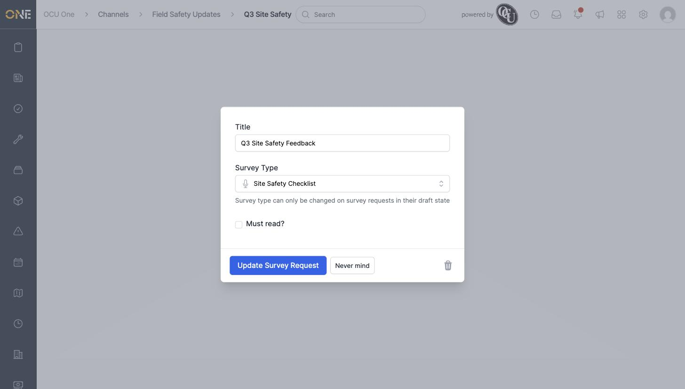
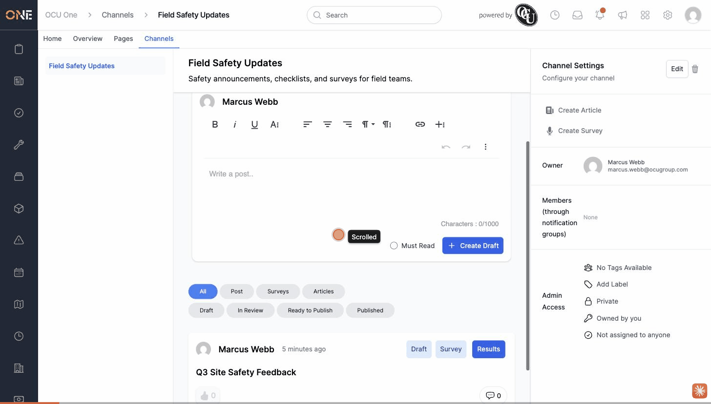

# A survey request's Edit modal has a delete/archive icon that 404s

**Status:** Open

## Description

A Hub survey request has two different places an admin can reach a delete/archive control: the "Survey Results" page (`.../survey_requests/:id/result`, reached via the **Results** button on the channel feed card) and a separate "Edit" modal (reached via the **Edit** button on that same Results page, or by navigating directly to `.../survey_requests/:id/edit`). The Results page's own trash icon works correctly and archives/deletes the request as expected. The Edit modal's trash icon does not — clicking it and confirming produces a routing error instead of deleting or archiving anything.

## Preconditions

- A `Hub::SurveyRequest` exists (any publish status).
- Signed in as a user who can manage the Hub channel it belongs to.

## Steps to Reproduce

1. Open a survey request's edit screen directly at `/hub/channels/:channel_id/survey_requests/:id/edit` (or via the **Edit** button on its Results page).
2. Click the trash icon at the bottom-right of the modal.
3. Confirm "Are you sure you want to delete this?".

## Expected Result

The survey request is deleted (if still in draft/in review) or archived (otherwise) — the same behavior the Results page's own trash icon already produces correctly.

## Actual Result

The click sends `POST /hub/channels/:channel_id/survey_requests/:id/result/new?_method=delete` and crashes with:
```
Routing Error
No route matches [DELETE] "/hub/channels/8/survey_requests/1/result/new"
```
The survey request is left completely untouched (no status change, not deleted) since the request never reaches a real controller action.

## Screenshot or Video



![Routing error after confirming delete from the Edit modal: "No route matches [DELETE] /hub/channels/8/survey_requests/1/result/new"](attachments/survey-request-workflow-actions-missing-and-delete-link-broken/01-routing-error-on-delete.jpg)



## Root cause

`app/views/hub/channels/survey_requests/edit.html.erb` builds its delete link from `@survey_request.routeable_route` for a draft/in-review request. `Hub::SurveyRequest#has_route` (`app/models/hub/survey_request.rb`) is defined as `new_hub_channel_survey_request_result_path(sr.hub_channel.id, sr)` — the GET-only "new response" route used elsewhere (e.g. the feed card's own link) — instead of `hub_channel_survey_request_path(@channel, @survey_request)`, the actual REST path mapped to `#destroy`. That correct path is exactly what the Results page's own delete icon (`Actions::EditDeleteButtonsComponent`, in `survey_request_result/show.html.erb`) already uses successfully.

For a request that isn't draft/in-review, the same modal's icon instead links to `archive_hub_channel_survey_request_path`, a custom `put :archive` member route (`config/routes/hub.rb`) with no matching `archive` action defined on `Hub::Channels::SurveyRequestsController` (only `destroy`) — equally broken, with a different error.

## Impact

Low — the Results page (the normal way to manage a survey request day to day) already has a working delete/archive control, so this doesn't block the underlying workflow. It only affects the redundant, less-visible delete icon inside the Edit modal, which a user could still click and hit a raw error page.
