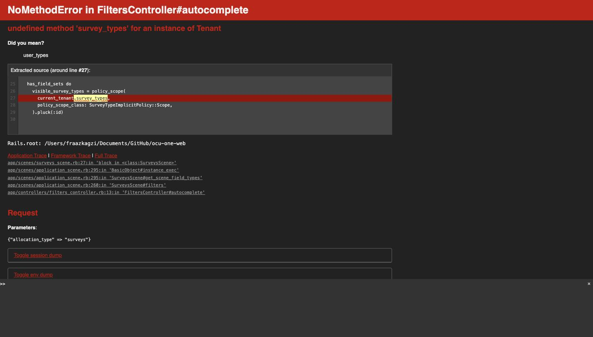
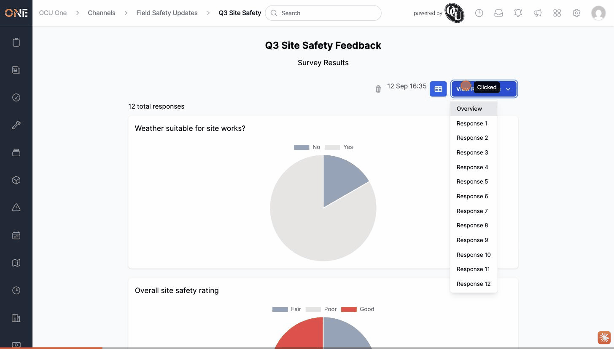

# Drilling into an individual survey response crashes instead of showing the response

**Status:** Open
**Found in:** [Viewing survey results and individual responses](../Hub%20-%20Surveys/Viewing%20survey%20results%20and%20individual%20responses.md)
**Area:** Hub - Surveys

## Description

On a survey request's Results page, the **View Responses** dropdown lists every individual response ("Response 1", "Response 2", ...) so an admin can drill into one respondent's answers. Clicking any of these links does not open that respondent's answers — it navigates to an unrelated "Surveys" list/kanban page, which itself crashes with a server error before it even finishes loading.

## Preconditions

- A published Hub survey request with at least one response.
- Signed in as a user who can view the survey request's Results page.

## Steps to Reproduce

1. Open a survey request's Results page (`.../survey_requests/:id/result`).
2. Click **View Responses**.
3. Click any individual response, e.g. "Response 4".

## Expected Result

The page navigates to that respondent's individual answers — the same view you get by visiting `.../survey_requests/:id/result?response=4` directly (a working page showing each field and its answer, e.g. "Weather suitable for site works?: No").

## Actual Result

The link instead navigates to `/hub/channels/:channel_id/survey_requests/:id/surveys?response=4` (the `Hub::Channels::SurveysController#index` list/kanban page, an entirely different screen from the intended response detail). That page's sidebar then makes a background request that crashes with:
```
NoMethodError in FiltersController#autocomplete
undefined method 'survey_types' for an instance of Tenant
```
(also reproducible as `NoMethodError in ColumnsController#autocomplete` depending on which sidebar element loads first). The individual response is never shown.

## Screenshot or Video





## Root cause

`Hub::Channels::SurveyRequestResult::ResponseDropdownComponent` (`app/components/hub/channels/survey_request_result/response_dropdown_component/response_dropdown_component.html.erb`) builds each per-response link with:
```erb
href: hub_channel_survey_request_surveys_path(@channel, @survey_request, response: id)
```
— the **Surveys index** path — instead of the Results page's own path with a `response` query param:
```erb
href: hub_channel_survey_request_result_path(@channel, @survey_request, response: id)
```
`SurveyRequestResultController#show` already fully supports `params[:response]` (it's exactly how the correct URL above renders one respondent's fields), so the fix is just correcting the path helper used in the dropdown link.

Separately, the Surveys index page it lands on is independently broken: `app/scenes/surveys_scene.rb:27` calls `current_tenant.survey_types`, but `Tenant` (`app/models/tenant.rb:25`) only defines `has_many :hub_survey_types, class_name: "Hub::SurveyType"` — there is no `survey_types` method, so any visit to that index page (not just via this broken link) throws immediately.

## Impact

Blocks the entire "drill into an individual respondent" workflow from the Results page — the only way to see one person's specific answers via the visible UI is to already know (or guess) the `?response=<id>` query-string trick on the Results page's own URL; every in-app link to it is broken.
