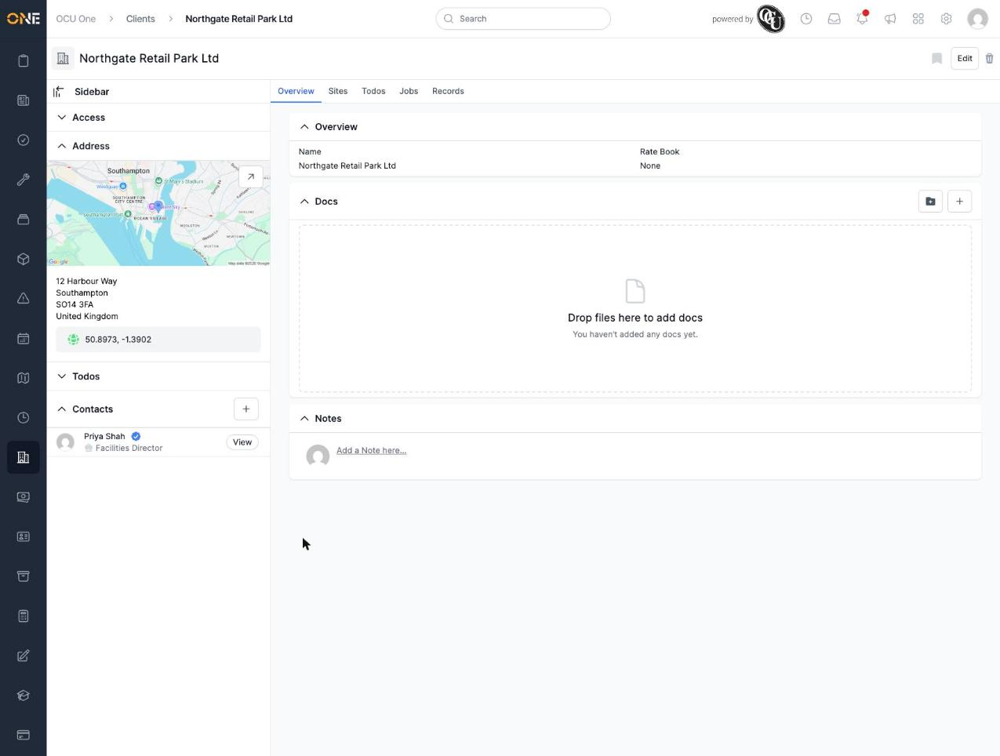
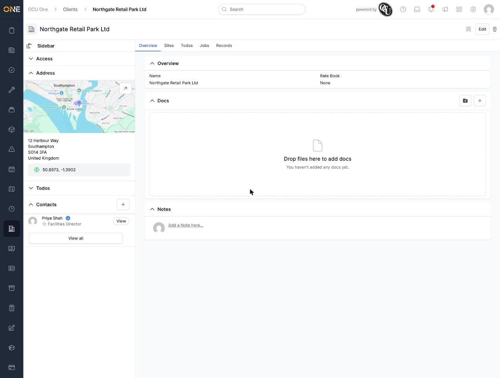
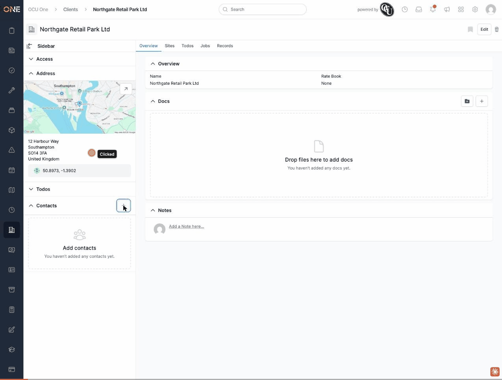

# "View all" contacts button missing until the page is reloaded

## What happens

On a record's Contacts card (the sidebar card showing who's listed as a contact — visible on Clients, Leads, Records, Tickets, Jobs, and most other record types), a "View all" button is supposed to appear underneath the contact list once at least one contact exists, linking to the full contacts list. When you add the *first* contact to a record that previously had none, the new contact appears in the list immediately (no page reload needed for that part) — but the "View all" button does not appear. Reloading the page makes it appear correctly.

Reproduced live, twice in a row:
1. Open a client with no contacts yet — the Contacts card shows the "Add contacts" empty state.
2. Click the "+" button and create a new contact ("Priya Shah, Facilities Director").
3. The contact appears in the list immediately — but no "View all" button is shown underneath it, even though one now exists.
4. Reload the page — the exact same contact list now shows a "View all" button underneath it.

This does not affect adding a *second* (or later) contact — once the "View all" button has appeared once (via a fresh page load), adding more contacts afterward doesn't make it disappear again. It's specifically the empty-to-one-contact transition that's affected.

## Root cause

`app/views/contacts/card.html.erb` renders either an empty-state block or a populated block, and only the populated block includes the "View all" button:

```erb
<% if @contacts.empty? %>
  <div ... id=<%= "contacts_list_#{@contactable.id}" %>>
    <!-- empty state -->
  </div>
<% else %>
  <ul ... id=<%= "contacts_list_#{@contactable.id}" %>>
    <% @contacts.each do |contact| %>
      <%= render "row", contact: contact %>
    <% end %>
  </ul>

  <div class="mt-6">
    <%= render Elements::ButtonComponent.new(title: t("view_all"), ...) %>
  </div>
<% end %>
```

Both branches use the same element `id` ("contacts_list_#{id}") — the empty-state `div` and the populated `ul` are interchangeable targets. But `app/views/contacts/create.turbo_stream.erb`, which handles the "create contact" form submission, only replaces that one element:

```erb
<%= turbo_stream.replace("contacts_list_#{@contactable.id}") do %>
  <ul ... id=<%= "contacts_list_#{@contactable.id}" %>>
    <% @contacts.each do |contact| %>
      <%= render "row", contact: contact %>
    <% end %>
  </ul>
<% end %>
```

When the record started with zero contacts, the page's DOM only contains the empty-state `div` — the "View all" button block was never rendered at all, since it lives in the `else` branch that never ran. The turbo stream swaps the empty `div` for a populated `ul`, but has no way to also add the sibling "View all" block next to it, because that block simply doesn't exist anywhere in the current page to be inserted next to. Only a full page reload re-evaluates `card.html.erb` from scratch, correctly takes the `else` branch this time, and renders both the list and the button together.

## Impact

Minor but real: after adding the very first contact to any client, lead, record, ticket, job, or other contactable record, there's no way to reach the full contacts list (with its table view, email/phone columns, and primary badge) until the page happens to be reloaded for some other reason. A user who adds one contact and then immediately wants to open the full list (e.g., to add a second contact from that screen, or double-check details) has no visible way to do so in that moment.

## Evidence







Reproduced in this session's local dev environment, 2026-09-09, against a disposable test client ("Northgate Retail Park Ltd", built for `Contacts & Addresses/Managing contacts on a client, lead, or other record.md`, kept as ongoing reference data — not deleted after capture, since that guide's screenshots also depend on it existing).
