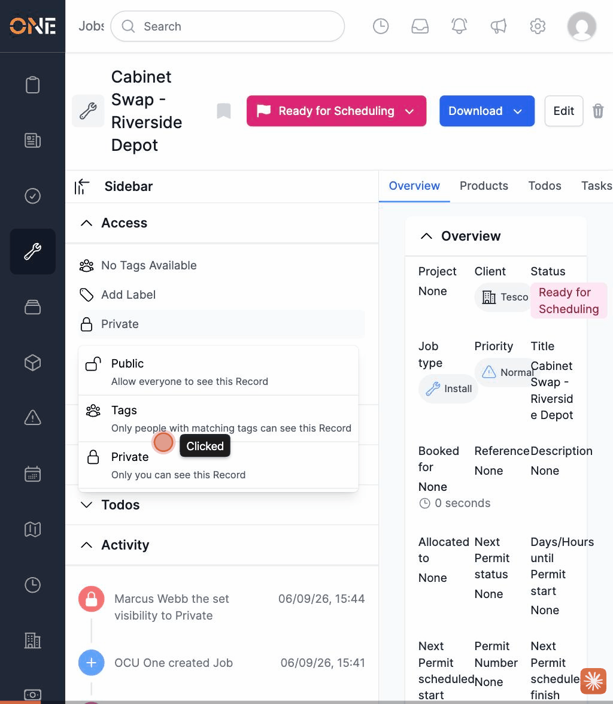

# Setting a record's visibility to "Private" logs a broken activity message

**Status:** Open
**Found in:** [Viewing a record's Access panel (visibility & ownership)](../Access%20%26%20Visibility/Viewing%20a%20record's%20Access%20panel%20%28visibility%20%26%20ownership%29.md)
**Area:** Access & Visibility

## What happens

On any record's Activity feed, changing the Access panel's visibility to **Public** or **Tags** logs a correctly-worded entry ("X set the visibility to Public" / "...to Tags"). Changing it to **Private** instead logs:

> "Marcus Webb the set visibility to Private"

The words "the" and "set" are transposed, so the sentence reads as broken English to every user who sees that record's activity feed afterwards. This is a copy/text defect only — the visibility change itself saves correctly (the icon, label, and dropdown all update to the correct "Private" state); only the activity log wording for this one case is wrong.

## Reproduction

1. Open any record with an Access panel (e.g. a Job's Main tab) and expand the "Access" section in the sidebar.
2. Click the visibility row, then choose "Private" from the dropdown.
3. Scroll to the Activity feed — the newest entry reads "**[User] the set visibility to Private**" instead of "[User] set the visibility to Private".

Reproduced twice in a row against Job "Cabinet Swap - Riverside Depot" (id 1437, throwaway test data, since removed), toggling Public → Private each time. See GIF below.

## Impact

Cosmetic/copy-only — no functional or data-integrity issue. But it's visible in every affected record's permanent activity history, so it's a persistent, user-facing wording bug rather than a one-off glitch.

## Evidence

Full walkthrough context: `Access & Visibility/Viewing a record's Access panel (visibility & ownership).md`. Found in this session's local dev environment, 2026-09-06.
