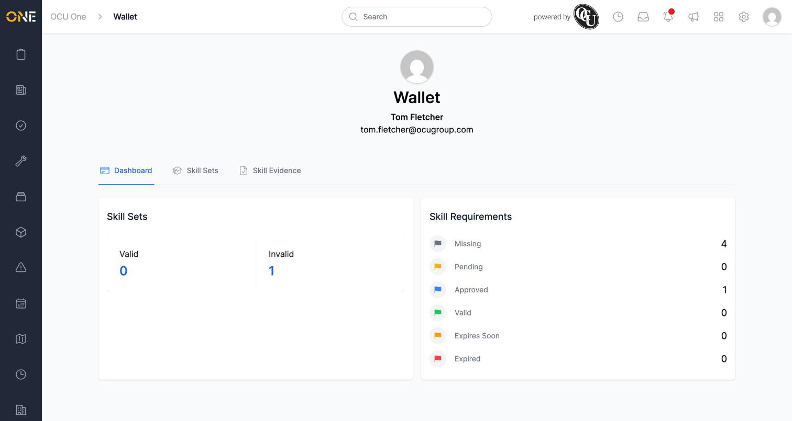
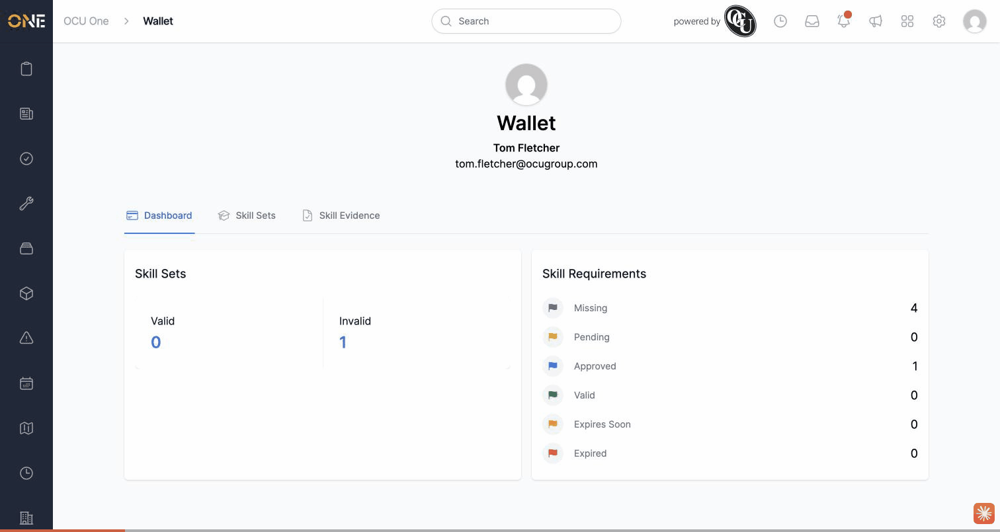

# The wallet's "Missing" skill requirement count is roughly double the real number

**Status:** Open
**Found in:** [Viewing your personal skills wallet](../Skills%20&%20Compliance/Viewing%20your%20personal%20skills%20wallet.md)
**Area:** Skills & Compliance

## Description

Your Wallet's **Dashboard** tab and **Skill Sets** tab both show an
"Outstanding"/"Missing" count of skill requirements you haven't provided
evidence for yet. For any requirement that has genuinely never had
evidence uploaded, that one requirement gets counted twice — once because
no evidence row exists for it at all, and again because its cached status
is separately "missing" — so the number shown is roughly double the real
count of skills you actually need to act on.

## Preconditions

- A user with a skill set assigned, where at least one mandatory skill
  requirement has never had any evidence submitted for it.

## Steps to Reproduce

1. Sign in as a user with a skill set that has 2+ mandatory requirements
   with no evidence submitted yet.
2. Go to **Wallet > Dashboard** and note the **Missing** count.
3. Go to **Wallet > Skill Evidence** and count how many requirements
   actually have no evidence.
4. Go to **Wallet > Skill Sets** and check the **Outstanding** column for
   the same skill set.

## Expected Result

The Missing/Outstanding count should equal the number of distinct skill
requirements with no evidence — in this case 2 (Electrical Safety Training
and Manual Handling Training both had zero evidence).

## Actual Result

Both the Dashboard's **Missing** stat and the Skill Sets tab's
**Outstanding** column show **4** — double the real count of 2 — because
each of the 2 genuinely-missing requirements is counted twice.

## Screenshot or Video

## Root cause

`SkillSet#outstanding_requirements` (`app/models/skill_set.rb`) computes
the result as `skill_requirements_without_evidences(user, mandatory:) +
missing_requirements`, concatenating two ActiveRecord relations with
plain Ruby `+` instead of a deduplicated union. Both relations describe
overlapping sets — "requirements with no evidence row for this user" and
"requirements whose cached `UserSkillRequirement` status is missing" are
true for the exact same requirements in the common case — so every
genuinely-missing requirement appears twice in the combined array before
`.size`/`.count` is called on it. This is used by the Wallet Dashboard
(`app/views/wallet/tabs/dashboard.html.erb`), the Wallet's Skill Sets tab
(`SkillSets::Labels::Progress::ProgressComponent`), and the equivalent
admin-side Settings user skill sets table
(`UserSkillSets::Lists::SimpleTableRowComponent`) — all three inherit the
same inflated count.

## Impact

Anywhere a user or manager looks at how many skill requirements are
outstanding, the number is inflated (typically ~2x when nothing has ever
been submitted), making compliance gaps look larger than they are and
undermining trust in the wallet's own summary numbers.
